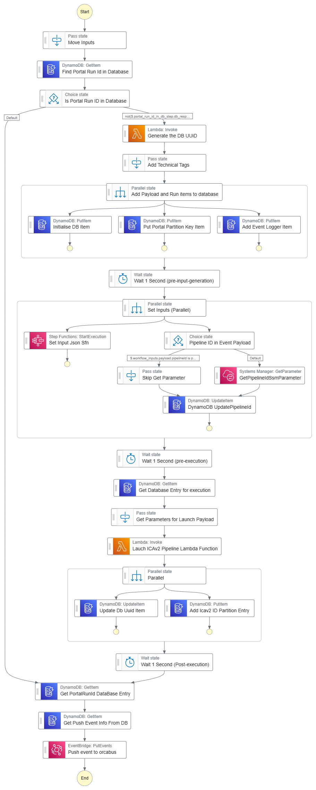

# Dynamodb Handle Ready Event From Workflow Run Manager for ICAv2 Workflow Run

## Summary

This step function construct listens to ready events from the workflow run manager through the main Orcabus event pipe.  

The step function is then triggered if the workflow type matches that specified in the step function.

If the portal run id is already in the database, then the step function just return the existing status

If the portal run id is not in the database, then the step function will launch the workflow on the ICAv2 platform.  
Then store the analysis configurations in the database and return an event back to the orcabus to say that the analysis has started running.  

## Example SFN 

> ICAv2 Ready Event Handler SFN




## Input

## Construct Inputs

* tableName - The name of the table to store the analysis configurations
* stateMachineName - This state machine's name
* workflowPlatformType - either cwl or nextflow.  
* pipelineIdSsmPath - The ssm parameter path to the pipeline id, the pipeline id can also be provided in the event, if the user wants to use a custom id.  
* icav2AccessTokenSecretObj - The secretsmanager object for the icav2 access token
* detailType - The detail type of the event to listen to (workflowRunStateChange)
* eventBusName - The event bus name (OrcaBusMain)
* triggerLaunchSource - The workflow run manager source to listen to (orcabus.wfm) 
* internalEventSource - The internal event source to push events to (orcabus.cttsov2)
* generateInputsJsonSfn - The step function to generate the inputs json for the workflow run (this is a subfunction of this step function)
* workflowType - The workflow Type, either cttsov2 or bclconvert_interop_qc
* workflowVersion - The workflow version (not currently used)
* serviceVersion - The service version (not currently used)

## Example input event

<details>

<summary>Click to expand</summary>

```json
{
  "version": "0",
  "id": "23440b51-5969-5d2b-c1d3-128dd0a3df1a",
  "detail-type": "workflowRunStateChange",
  "source": "orcabus.wfm",
  "account": "843407916570",
  "time": "2024-05-13T00:12:11Z",
  "region": "ap-southeast-2",
  "resources": [],
  "detail": {
    "refId": null,
    "version": "0.1.0",
    "status": "ready",
    "projectId": "7595e8f2-32d3-4c76-a324-c6a85dae87b5",
    "userReference": "bclconvert_interop__semi_automated__umccr__pipeline__20240513ba2b787f",
    "bclconvertReportDirectory": "icav2://7595e8f2-32d3-4c76-a324-c6a85dae87b5/ilmn_primary/2023/231116_A01052_0172_BHVLM5DSX7/3661659/20240307abcd7890/Reports/",
    "interopDirectory": "icav2://7595e8f2-32d3-4c76-a324-c6a85dae87b5/ilmn_primary/2023/231116_A01052_0172_BHVLM5DSX7/3661659/20240307abcd7890/InterOp/",
    "runId": "231116_A01052_0172_BHVLM5DSX7",
    "analysisOutputUri": "icav2://7595e8f2-32d3-4c76-a324-c6a85dae87b5/interop_qc/20240513ba2b787f/out/",
    "icaLogsUri": "icav2://7595e8f2-32d3-4c76-a324-c6a85dae87b5/interop_qc/20240513ba2b787f/logs/",
    "userTags": {
      "projectname": "trial"
    }
  }
}
```

</details>

## Requirements of the generateInputsJsonSfn

Creates the input_json for the workflow and writes the input_json to the database under the column `input_json`.  
This input json should be a json-dumped string.  

An example of the input json can be seen in the bclconvert-interop-qc stack.

