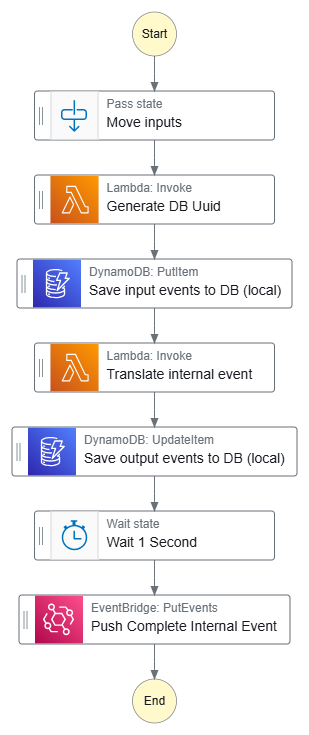

# Parse external event detail

This step function is designed to mock the workflow manager.  

In this case, WorkflowRunStateChange events are persisted from another microservice and
resubmitted by the workflow manager.  This is a common pattern.

The only difference is, that for WorkflowRunStateChange detail types from the workflowManager,
we expect detail.payload.refId to be populated by a uuid.  

## Step function overview



## Example input event

```
{
  "version": "0",
  "id": "f71aaaaa-5b36-40c2-f7dc-804ca6270cd6",
  "detail-type": "WorkflowRunStateChange",
  "source": "orcabus.bclconvertmanager",
  "account": "123456789012",
  "time": "2024-05-01T09:25:44Z",
  "region": "ap-southeast-2",
  "resources": [],
  "detail": {
    "portalRunId": "202405012397actg",
    "timestamp": "2024-05-01T09:25:44Z",
    "status": "SUCCEEDED",
    "workflowName": "BclConvert",
    "workflowVersion": "4.2.7",
    "workflowRunName": "540424_A01001_0193_BBBBMMDRX5_c754de_bd822f",
    "payload": {
      "refId": null,
      "version": "0.1.0",
      "data": {
        "projectId": "bxxxxxxxx-dxxx-4xxxx-adcc-xxxxxxxxx",
        "analysisId": "aaaaafe8-238c-4200-b632-d5dd8c8db94a",
        "userReference": "540424_A01001_0193_BBBBMMDRX5_c754de_bd822f",
        "timeCreated": "2024-05-01T10:11:35Z",
        "timeModified": "2024-05-01T11:24:29Z",
        "pipelineId": "bfffffff-cb27-4dfa-846e-acd6eb081aca",
        "pipelineCode": "BclConvert v4_2_7",
        "pipelineDescription": "This is an autolaunch BclConvert pipeline for use by the metaworkflow",
        "pipelineUrn": "urn:ilmn:ica:pipeline:bfffffff-cb27-4dfa-846e-acd6eb081aca#BclConvert_v4_2_7"
      }
    }
  }
}
```

## Example Output Event

```
{
  "version": "0",
  "id": "f71aaaaa-5b36-40c2-f7dc-804ca6270cd6",
  "detail-type": "WorkflowRunStateChange",
  "source": "orcabus.workflowmanager",
  "account": "123456789012",
  "time": "2024-05-01T09:25:44Z",
  "region": "ap-southeast-2",
  "resources": [],
  "detail": {
    "portalRunId": "202405012397actg",
    "timestamp": "2024-05-01T09:25:44Z",
    "status": "SUCCEEDED",
    "workflowName": "BclConvert",
    "workflowVersion": "4.2.7",
    "workflowRunName": "540424_A01001_0193_BBBBMMDRX5_c754de_bd822f",
    "payload": {
      "refId": "018fa95e-b57c-748f-8cdb-6ee178bf1136",
      "version": "0.1.0",
      "data": {
        "projectId": "bxxxxxxxx-dxxx-4xxxx-adcc-xxxxxxxxx",
        "analysisId": "aaaaafe8-238c-4200-b632-d5dd8c8db94a",
        "userReference": "540424_A01001_0193_BBBBMMDRX5_c754de_bd822f",
        "timeCreated": "2024-05-01T10:11:35Z",
        "timeModified": "2024-05-01T11:24:29Z",
        "pipelineId": "bfffffff-cb27-4dfa-846e-acd6eb081aca",
        "pipelineCode": "BclConvert v4_2_7",
        "pipelineDescription": "This is an autolaunch BclConvert pipeline for use by the metaworkflow",
        "pipelineUrn": "urn:ilmn:ica:pipeline:bfffffff-cb27-4dfa-846e-acd6eb081aca#BclConvert_v4_2_7"
      }
    }
  }
}
```

