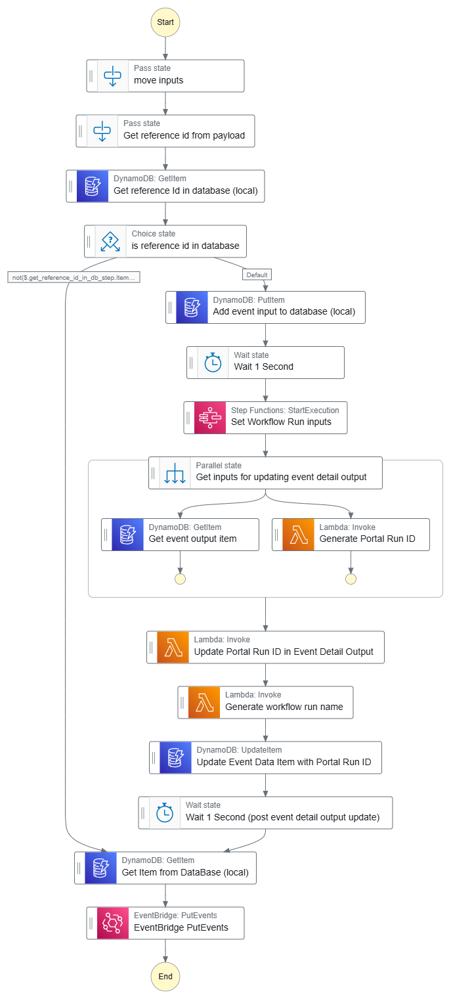

# InputMaker Step Function stack

This step function is a wrapper function that 

1. Takes in an input event
2. Writes the event body to the specified database
3. Calls the specified step function to generate the inputs, will be custom for each stack
4. Collects the input maker outputs and writes them to the specified database
5. Generate the portal run id
6. Generate the workflow run name
7. Updates the input data event 
8. Pushes an event to the eventbus with the inputs of a workflow 
   - these are to be consumed by the workflow run manager, which relaunches these as a ready event

This is useful for workflow run manager event glues!

Each glue piece can use its own database here.  This database does not need to write to other databases.  

The sub-function may however read / write to other databases depending on its needs.  

