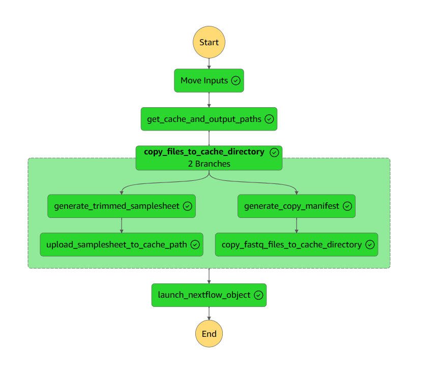

# ctTSO v2 pipeline manager

<!-- TOC -->
* [ctTSO v2 pipeline manager](#cttso-v2-pipeline-manager)
  * [Inputs](#inputs)
    * [Example Input](#example-input)
  * [Outputs](#outputs)
  * [Lambdas in this directory](#lambdas-in-this-directory)
    * [Get Cache and Output paths](#get-cache-and-output-paths)
    * [Generate a trimmed samplesheet](#generate-a-trimmed-samplesheet)
    * [Upload the samplesheet to the cache path](#upload-the-samplesheet-to-the-cache-path)
    * [Generate a copy manifest](#generate-a-copy-manifest)
    * [Launch the nextflow pipeline](#launch-the-nextflow-pipeline)
  * [SSM Parameters](#ssm-parameters-)
    * [External Parameters required by CDK](#external-parameters-required-by-cdk)
<!-- TOC -->

This AWS step functions performs the following actions

* Copies a set of fastq files to a structured location (via the icav2 copy batch utility)
* Uploads a samplesheet to the same structured location
* Invokes the ctTSO v2 pipeline calling the structured location as the run folder



## Inputs

The AWS Step functions takes in the following parameters:

* project_id
* sample_id  (should match the sample_id in the samplesheet, ideally the lab metadata library id)
* portal_run_id  (unique identifier for this step functions run and determines the data output location)
* user_reference (an identifier for the run, can also be the same as the portal run id)
* user_tags: (as a dict)
  * subject_id
  * library_id
  * instrument_run_id
  * project_owner
  * project_name
* technical_tags: 
  * These are generated by the AWS Step functions and comprise the step_functions_execution_arn and the portal_run_id
  * So should be left blank for now
* samplesheet_b64gz: (a base64 encoded and gzipped samplesheet as a dictionary, this can be found as an output of the bssh_icav2_fastq_copy_manager step functions)
* fastq_list_rows_b64gz: (a base64 encoded and gzipped list of fastq rows as a dictionary, this can be found as an output of the bssh_icav2_fastq_copy_manager step functions)
  * This will use only the fastq files whose RGSM attribute match the sample id

### Example Input

```json5
{
  "project_id": "7595e8f2-32d3-4c76-a324-c6a85dae87b5",
  "sample_id": "L2301368",
  "portal_run_id": "20240308abcd1234",
  "user_reference": "PTC-ctTSO-v2-launch-test",
  "user_tags": {
    "subject_id": "SBJ04405",
    "library_id": "L2301368",
    "instrument_run_id": "231116_A01052_0172_BHVLM5DSX7",
    "project_owner": "UMCCR",
    "project_name": "testing"
  },
  "samplesheet_b64gz": "H4sIAAAAAAAAA91b227bOBB9z1cU3tek0M2WlD5pVUAo0M0uGvahWCwGsq20Qm3ZlZV0i0X/fTmUGcvlULQVxmiNIAEcUuKZIefqw/8uXrwYfSryeVGPrl/8xz/xz3flooC7Vb3MG3go6k25qvigd9mO1vcVVPmy4P8asc2X6uqmmL67STzfdV3/6o+3RXHL3oE7uVk9eP5o+1BZbZr6fllUDTTf1uJZPp7fFl9GfMJ3nDWqOYzNDgV+BBdm32aLAv/tjt3LzohHjZTVvPh37yFnb6T7kPO48HS2mK0qLmkDm6JpyupjB8ayrMrl/RKaulwuizmIxRdF9bH5xCf548v9afk8XzdFDSv+ukW+xilyRr75DJtPK76KlPTx6c3qrvma10VH3aPgpfcyHFEg53mT8xl/i2dbmHzCIq9Qr1tV4Evz5ZpvZDnHt731fMf1J9HocVhoBIeyJGVZkrEk+2HQw9GUjyYsTZJ0N4rC1eW82Glz9D68cT+4gf/qjeuIX/mP3VNSNe3GinezjKX8hy+Q8HX4Mkwz3dNNF7O/Xw5QRUyogmshTbg+soRSBS6fcRAZOy9VhA6hijTlJ4KvwlJKFXzJjIkJZ6YKlzQQPBbcPkgDSTJ+KHDhMzOQ0KNOBWMoLF+B9BV8mB+bLDk3A/HJU4E7n+3te/dU8PPCJ6S/noF4faoIJvzNPAUgnWfrPemzgUGEsf0ocxYKCbUKScUyfBGm8RtMxNbkzBQS6U8Idw+oD02mwZfm54db1JkpJNYqRKQamc6dcl2gstgvmG/0KmTs6E+IeDdGVE3WgWlH9guG2l6FhAGhCmEqbD+CdNwpxlmccG6qGJOOlOehCQZb0m/gwgjhzMwkolSBOQUaCaWITCxoMI4PvFp+9Sa68do/+PEJEEPShtGj0SUUWi/miFYh+r0QJ9SBQjeS0JaVibTOEJXtQiSrcoY/jEwdMjwBpsTBLkSqWmYi/81IiPwYYmg74UbHZBUrAiidoqfoVLgqTwiRri6Z6LBockSRQZ4QIlX1YaqKnQ/6LHJ7Zpldp9MPkarG+ElMsI+li5Vo8CeESLluEcw1XTbWJjZ2Nzrog+hRZzFNhe8jNxqh7x+CZ4dInUURW7lz0Wx0sm9Kzw6R7AxgR5XR3SJRE2aWA2A/RCq5xOPG80tNpd5WrSeESJlLggA1Fs1DNxaLpzyLVBqRiY6GJhlTuqfPDpFKxrBi0jkdtGZjdWkXIpXpYEHHdC13UQ1aTmn7IWq+F8DWlia64D5bznR6IfpUppOhPWS0RaM971v7s0OkoosojRJdGpGI4HNCiHR/GzMdXTKWMWO7zi5EKrq0CS1t0VjV7Pcbnx0iFV3asoC26ES0+Czni/0Q6eiSiZyLNJdE9O5PqMWAjtE8AmYaLWJkNPXSrUL8OSrAXog/R3nVD5Hs9CXtVyearJtr0dAS10Pkf//BJ0ezxep+TtAbPhZVUedNMe9SD5yX/Ge74vbJr6v6891i9RWHy1n++BmkzrsEhXW5Lhal0Mbovq6uy8WS/5nl13LgenoX+9Px7O5qNvXCq2B+l19FwaS4ymfzSTF1Ijef5b/9Pluk2zc+BOBBhw3RgqKJEIZiZ1FO67z+9shhkTNAFj+gVjrymXVdrOFz2XQJMLfsHX0eDBWNBocHssIBtZyxhsM34vBBljGg1izWcARGHAHIWgXUwsQajrERxxhkQQJq9WENx8SIYwKy6gC1xLCGIzTiCEGWFqDWEdZwREYcEcj6AdRiwRqO2IgjBlkkgFoR2MLRzfxpHL4DshIANe23hsPoT30XZLoPam5vDYfRn/oeyJwe1ATeGg6jP/V9kIk7qFm6NRxGf+oHILNzUFNxaziM/tRHf9qm4KDm27ZwBEZ9BBhf2jwb1KTaGg6FNaNBs50HOy4NUMQZLa5Zw27/fPAOB6awVzTAtvNgx2kBisBiD5jCItEAi6TGHrklQBFJ7AFT2BwaYNt5sON4AEXosAZMZVXQwOQ82HEtgCJWWAM2MQbxSQQ7EjJQjGN7YIyRfCIi+ZYGDBTn1xqY0BjOQwd2RFygWLf2wBhjeujCjgoLFO/VHhhjYA8xsEsyKlDMU3tgjNE99GFHBwWK+2kPjDGkhQHsuENAEYXsgTHG+XAMO/YOUFQda2AiI5hoDJI/AypZRgukveByOA5jERdNQDJQQKWbWMNhLOKiECRZB1RmjjUcRv8fRSDpLqByW6zhMLr+KAbZ0QS1fdmXDN7k1epgILHR7ccOSOYKqDQVe0CMLj9Gl982UEHtltoDYnT3sQeShQIq5cQeEKOrj32QXBNQiSX2gBjdfByAbByD2iW2B8ToVeMxSGoLqDyWA4FcyEZ1s1mNHWdBtKqPYWceyM38YfK0+JQ/lKt7vAs5wgt/csKhlwB7rvgdxUi9kH1uqY2DO91qpbmdJK9dvr7pnpIfOZ5PuMxRhtBesmzhvH/9l+M43e9Yx+T4wXWXUqkOE+z4SxmkYL5BMP8Jle7AHTv6cgUpWGAQLHhCpTxMsOMvSZCCjQ2CjZ9QaQ/csaMvO5CCTQyCTQZV6geI5JJ7deRdYlKk2CBSPKjeHybS8XeCKZFcp18kPn6oSN2uwTCRjr/bS4rkGkTSfE9u6D0MPXjH3tElRTLEK3dYB2PgLh1915YUyRCp3MMjVbcPMnSXjr0zS4pkiFHu4TGq200Z5sSPv6ZFimSITu7h0anbkxmaIh173YoUyRCX3Ekn9b/4fvE/hhiak4tEAAA=",  /* pragma: allowlist secret */
  "fastq_list_rows_b64gz": "H4sIALln6WUC/+Wd32/cNgzH/5Ugz7XPkvyzb66LaQXSl9odBgyD4fO5Q7Dk0l3TDt2w/32kstOtKatLlL7wiD6UTg64fsl+LIqm6F/+Pn9jX708f352bttusK0dWpt2YLZD17Zdqs6fncFH+tf4kQttMmXK+u5nFy/wZ2+3v29v/txeXK530+4z/uZi2i7wG4UfWqaN+uHyann75lW/m/Hzl/P0ST9frdbavFsXqkw2daGTvKmLZNrMc1IbNSu91PNG69Xl1fU2mbbT1ecPy4eVNkqpcmwzlRV6zFSlxxc//nTxunjZ/1yNG52XhRrzuck2c/Jivuputp+W3e3Zp3zUY5WsK9XM9aZJiqXcwBcuZTLV6yWZJ1Wti6XZ5Nl6dfPx9v3H21U/Xb+/gm9EKaNa7XV7Y+zVeJFlanyjRvgrfTd9uP0j/e2v8/8065PWrEnN+zj/X3BVNMVSv9OJ0RuT5HMF3290nszlVBebaanhX+EEj+93l9fw/2elM23ColemLFVZNPjRPDNZNa3nTVU32XeLGgcF92Lwz7OzA8kAcdcCzrZNBzAtcG0HkuRGKMmNN8ZeCyGZ0syL5MdHjYOCEMldB+sxMDx0aQtID+6KIrnKZJJcZd4YeyODZFIzK5IjosZBQYhk6xZlSK5t2lpYkiHFprPrSgkl+WCMfS6EZEozL5IfHzUOCoJr8jAgvsPQph3YsELblsyuKy2UZO2NsS+EkExp5kXy46PGQUF4Tcal2OJC7OpecNXR2bURSrLxxtiXQkimNPMi+fFR46AgXPG6K3nBmoyF62FwZWz9Ncl5Oe6W3cftg3jWp8Lz/sa4V3/vcuwr9LE+WbYfrJ8F598pmtzUBHNywN9trwfcXQ/u8VVL8l+J5r/60sfV3se1EP6P6efF/9OiyU1NcP2HfTjij8+uIZ2HVACyepL/WjT/9Zc+rvc+boTwf0w/L/6fFk1uasI7+c5i+g+LPqCPNwLYAZD8N6L5b770cbP3scqE3ACOOoDXHeCJ8WQnJ5gDtJABdPhsDZ+V48NyuCtQ94Aik3wP2Ku/dwlOVjLuAccdwOoe8NR4spMTuge4XcDgyvjuwRxekfeAKpdJf5V7A1yqZRBPi2ZFeUzcWEgIV/UsZPT4hC51BT0s8pFZfVUIpbnwBrjUCKGZFM2L5oi4sZBwpAMOT5S0Ka7KWKOnSK6FklwX3gB35jJIpkWzIjkmbiwkhHfaWGqzQDIeLIFEmyS5Ekpy5Q1wZyGEZFI0L5Ij4sZCQjDDxjIZZNipdZ1wQ5saguTyQSSbUyF533xUl94Ad7o2JHOyJIdFsyD5KXFjISGYXQ/4B7bHFnPs9hsk10JJrr0B7qyEkEyK5kVyRNxYSAjWsF1Puh1S2CLjU21LktwIJbnxBrizFkIyKZoXyRFxYyEhnF1jI0rbpR3WsWFhpkhuMpkkN5k3wJ2NDJJp0axIjokbCwnh2vXgJiJhd7lrNCdJVkJJVt4Ye50JIZkUzYvkiLixkBA+Kda5iUgplrA7yLVJkrVQkrU3wJ1KCMmkaF4kR8SNhYQj3SEtjix0nV5YxyZJNkJJPhjgTi2EZFI0L5Ij4sZCQrDihR2beGB7uGvbprPrQijJhTfAnUYIyaRoXiRHxI2FhCPzCl3TJvZrWpdm51+TrB+2T85PheR936tW3gB3ukab/GRJDotmQfJT4sZCQnhNxuJ112F23brSF0WyFkqy9ga4sxBCMimaF8kRcWMhIVi7xsH+kFWnbkgKrMokyUYoycYb4M5SCMmkaF4kR8SNhYQjfdd4wBFnnN1NOyJJzoWSfDDAnZUQkknRvEiOiBsLCeF5RTimaLBp2+H40W/skwuhJBfeAHfWQkgmRfMiOSJuLCQEs2s3bBRPNe5f1EGRXAolufQGuLMRQjIpmhfJEXFjISHcrelGh+I+uXMskyRXQkmuvDH2JhNCMimaF8kRcWMhIXyCAvs17d0scDfenyK5Fkpy7Q1wpxJCMimaF8kRcWMh4cibLHGuP/Z4YXJt6dp1I5TkxhvgTi2EZFI0L5Ij4sZCwpEJvfh66TbFyrUrYhMkm0wmySbzBrjTyCCZFs2K5Ji4sZAQnrHppnfdTRrovvE82Qjt8TLKG+BOIT1etGheJEfEjYWE8Jss8SyUO9VoXb8XSbLQHi+jvQHuFNLjRYvmRXJE3FhICK7Jbs5Aa3EiX+teg0WRLLTHyxhvgDuF9HjRonmRHBE3FhKOnGp0b5TGd1hY9zILimShPV7mYIA7hfR40aJ5kRwRNxYSwj1e1p1nTLFT07b082QjtMfLFN4Adwrp8aJF8yI5Im4sJIT7rocOpw2kbt4AtogQJOdC1+T8YIA7hfR40aJZkRwTNxYSHjdbM4+erXlyJBMDDk+fZFo0K5Jj4sZCwuMm8uXRE/lOjmRiLNrpk0yLZkVyTNxYSDhSu7buBAU+Vbb4giiKZKHZdXMwxj6XQjIpmhfJEXFjIeE+yb/+C4TOMeRCoAAA"  /* pragma: allowlist secret */
}
```

## Outputs

The AWS Step functions returns the following parameters:

The analysis ID of the nextflow pipeline run launched by the step functions lambda 

The CreateNextflowAnalysis submission as a JSON object for reproducibility

```json5
{
  "analysis_id": "3e17b6ff-ff63-43ab-ac15-e939e88932b6",
  "analysis_launch_payload": {
    "userReference": "PTC-ctTSO-v2-launch-test",
    "pipelineId": "fdef5902-3f50-4ee7-ae17-15d38d4b489c",
    "tags": {
      "technicalTags": [
        "portal_run_id=20240308abcd1234",
        "step_functions_execution_arn=93f7c69b-66eb-4890-8eb4-298ec3b36d37"
      ],
      "userTags": [
        "subject_id=SBJ04405",
        "library_id=L2301368",
        "instrument_run_id=231116_A01052_0172_BHVLM5DSX7",  /* pragma: allowlist secret */
        "project_owner=UMCCR",
        "project_name=testing"
      ],
      "referenceTags": []
    },
    "analysisInput": {
      "inputs": [
        {
          "parameterCode": "run_folder",
          "dataIds": [
            "fol.58422302edd141213e0f08dc3cace45e"
          ]
        },
        {
          "parameterCode": "sample_sheet",
          "dataIds": [
            "fil.94813f45b9e94977b0a308dc388cf24f"
          ]
        }
      ],
      "parameters": [
        {
          "code": "StartsFromFastq",
          "value": "true"
        },
        {
          "code": "sample_pair_ids",
          "multiValue": [
            "L2301368"
          ]
        }
      ]
    },
    "activationCodeDetailId": "7f03a57e-2cfc-4b35-9cbb-d19e6ce9984b",
    "analysisStorageId": "3fab13dd-46e7-4b54-bb34-b80a01a99379",
    "outputParentFolderId": null,
    "analysisOutput": [
      {
        "sourcePath": "out/",
        "targetProjectId": "7595e8f2-32d3-4c76-a324-c6a85dae87b5",
        "targetPath": "/ilmn_cttso_fastq_cache/20240308abcd1234/",
        "type": "FOLDER"
      }
    ]
  }
}
```

## Lambdas in this directory

### Get Cache and Output paths

Combine the root cache and root output ssm parameters with the portal run id submitted in the inputs

### Generate a trimmed samplesheet

Generate a samplesheet that only has the TSO500L sections and only for the sample_id submitted in the inputs

### Upload the samplesheet to the cache path

Upload the samplesheet dict as a samplesheet csv to the cache path

### Generate a copy manifest

Generate a copy manifest for submissions to the icav2 copy batch utility

### Launch the nextflow pipeline

Take the fastq output locations, samplesheet location and metadata generated in the inputs and run the launch nextflow object.

## SSM Parameters 

### External Parameters required by CDK

```
/icav2/umccr-prod/service-user-trial-jwt-token-secret-arn
/icav2_copy_batch_utility/state_machine_arn_batch
/icav2/umccr-prod/cache_project_cttso_fastq_path
/icav2/umccr-prod/output_project_cttso_fastq_path
/icav2/umccr-prod/tso500_ctdna_2.1_pipeline_id
```