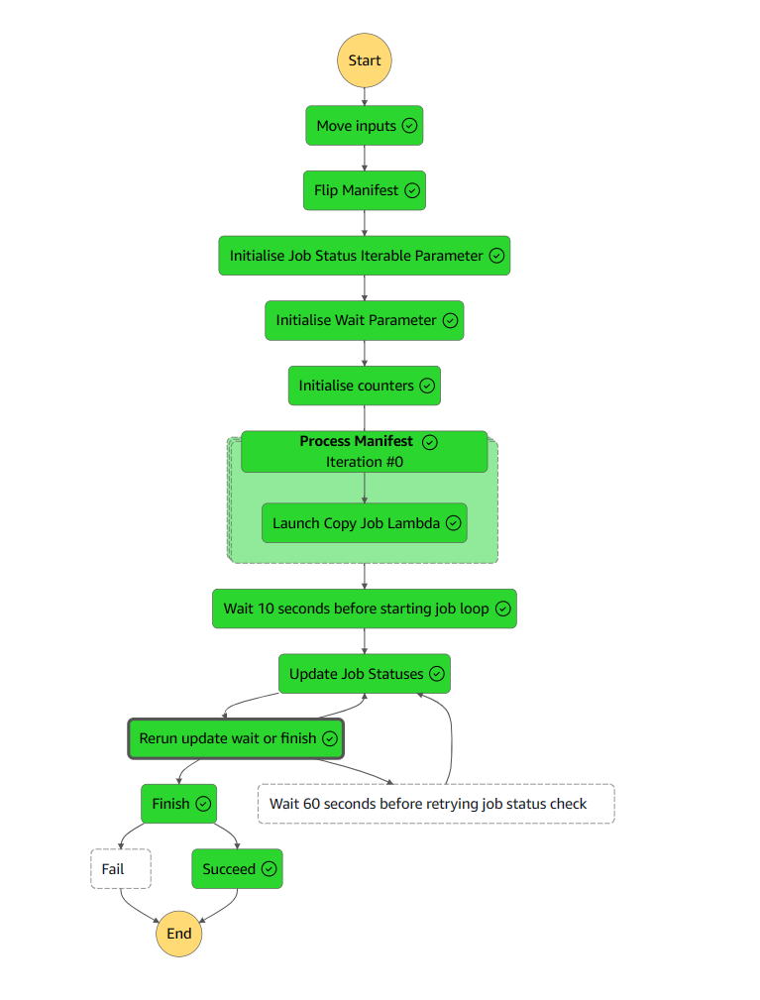

# ICAv2 Copy Batch Utility

<!-- TOC -->
* [ICAv2 Copy Batch Utility](#icav2-copy-batch-utility)
  * [Overview](#overview)
  * [Inputs](#inputs)
  * [Outputs](#outputs)
  * [Lambdas in this directory](#lambdas-in-this-directory)
    * [Flip Manifest](#flip-manifest)
    * [Launch Copy Job](#launch-copy-job)
    * [Update job session](#update-job-session)
  * [SSM Parameters](#ssm-parameters-)
    * [External Parameters required by CDK](#external-parameters-required-by-cdk)
<!-- TOC -->

## Overview

The icav2 copy batch utility CDK wraps an AWS Step Function over the ICAv2 CopyBatch API.  
This api is designed to copy a list of illumina file ids into a directory.  

We exploit this API by taking in a manifest (a list of key values of source ids with their respective destinations) (
a source may have multiple destinations if it needs to be copied into a few different places
), and then monitor a set of API jobs to completion. 

These CopyBatch API jobs have about a 20% fail rate, so we sometimes need to resubmit, this is built into the step function.

A 20% fail rate seems quite high, but when they work, these jobs can transfer 80 Gb of data in under 10 seconds so it's worth
persisting with.  

When working with the ICAv2 CopyBatch API, we need to provide a unique identifier for the run, and a unique location for the outputs.

Once all jobs are deployed we monitor their status (redeploy if failed - up to five times) and wait for all jobs to complete.

This process will transfer an entire BCLConvert process from one ICAv2 project to another in under 10 minutes!  

Note that a current limitation prevents using this API within the same project.  




## Inputs

* Statemachine expects the following inputs:
  * One of `manifest` or `manifest_b64gz`.  


An example is below

```json
{
  "manifest": {
    "icav2://b23fb516-d852-4985-adcc-831c12e8cd22/ilmn-analyses/231116_A01052_0172_BHVLM5DSX7_d24651_4c90dc-BclConvert v4_2_7-b719c8d9-5e6d-49e6-a8be-ca17b5e9d40b/output/Samples/Lane_1/L2301368/L2301368_S1_L001_R1_001.fastq.gz": [
      "icav2://7595e8f2-32d3-4c76-a324-c6a85dae87b5/ilmn_cttso_fastq_cache/20240308abcd1234/L2301368_run_cache/L2301368/"
    ],
    "icav2://b23fb516-d852-4985-adcc-831c12e8cd22/ilmn-analyses/231116_A01052_0172_BHVLM5DSX7_d24651_4c90dc-BclConvert v4_2_7-b719c8d9-5e6d-49e6-a8be-ca17b5e9d40b/output/Samples/Lane_1/L2301368/L2301368_S1_L001_R2_001.fastq.gz": [
      "icav2://7595e8f2-32d3-4c76-a324-c6a85dae87b5/ilmn_cttso_fastq_cache/20240308abcd1234/L2301368_run_cache/L2301368/"
    ]
  }
}
```

OR

```json5
{
  "manifest_b64gz": "H4sIAAAAAAAAA+2SzUoDMRhF932KoWvT/P9111ZFod0oqCASMklaBqYzY5IOFvHdHRXBlYtutND9x/3uOdzXUVGMK2d7MoWwJHRdciyAV5wAphUH1jsHFMUOk6CcJwRW9bYBtrH1PoUECcUYCzNDGHFiEJbEzK/ulit+fvsgjSdMcGyY08g7MHf1om36EHPRM0OMBKXE2imvAQ/CDw+DAFaVATiLZcmD9gyVsN3lbpfhst0keGlTfl60264OOUzySx5Pi8cB4QeE5JoHtSaAEk8Bc3LIpIQBJ6zi3gY1JH9CmC5WWxv3kCBCfweBVAgsuP44ZYgiaUvnpdLoq9V4aPB0dlwm721sqmaTJnW7OUk8UOJFjG08KTxQ4U3o2pgTnHnb5RDNKuRYuTRxqf9rnd/Vjszo5wqum3X7vyY5ehu9Ax+WAaFoBgAA" /* pragma: allowlist-secret */
}
```

## Outputs

```json
{
  "job_status_iterable_parameter": {
    "job_status_iterable": 1
  },
  "wait_parameter": {
    "wait": true
  },
  "counters": {
    "jobs_failed": 0,
    "jobs_running": 0,
    "jobs_passed": 1
  },
  "job_list_with_attempt_counter": [
    {
      "job_attempt_counter": 1,
      "job_id": "6f3d6981-0dff-4413-8388-2bb445d03dd7",
      "failed_jobs_list": [],
      "dest_uri": "icav2://7595e8f2-32d3-4c76-a324-c6a85dae87b5/ilmn_cttso_fastq_cache/20240308abcd1234/L2301368_run_cache/L2301368/",
      "source_uris": [
        "icav2://b23fb516-d852-4985-adcc-831c12e8cd22/ilmn-analyses/231116_A01052_0172_BHVLM5DSX7_d24651_4c90dc-BclConvert v4_2_7-b719c8d9-5e6d-49e6-a8be-ca17b5e9d40b/output/Samples/Lane_1/L2301368/L2301368_S1_L001_R1_001.fastq.gz",
        "icav2://b23fb516-d852-4985-adcc-831c12e8cd22/ilmn-analyses/231116_A01052_0172_BHVLM5DSX7_d24651_4c90dc-BclConvert v4_2_7-b719c8d9-5e6d-49e6-a8be-ca17b5e9d40b/output/Samples/Lane_1/L2301368/L2301368_S1_L001_R2_001.fastq.gz"
      ],
      "job_status": true
    }
  ]
}
```

## Lambdas in this directory

All lambdas run on python 3.11 or higher.

### Flip Manifest

This lambda takes in a manifest and flips the keys and values.
The dictionary becomes a list of objects where the keys are values under `dest_uri` and values are under 
the list `source_uris`

In the example above, because both files are heading to the same directory we get the following output

```json
[
  {
    "dest_uri": "icav2://7595e8f2-32d3-4c76-a324-c6a85dae87b5/ilmn_cttso_fastq_cache/20240308abcd1234/L2301368_run_cache/L2301368/",
    "source_uris": [
      "icav2://b23fb516-d852-4985-adcc-831c12e8cd22/ilmn-analyses/231116_A01052_0172_BHVLM5DSX7_d24651_4c90dc-BclConvert v4_2_7-b719c8d9-5e6d-49e6-a8be-ca17b5e9d40b/output/Samples/Lane_1/L2301368/L2301368_S1_L001_R1_001.fastq.gz",
      "icav2://b23fb516-d852-4985-adcc-831c12e8cd22/ilmn-analyses/231116_A01052_0172_BHVLM5DSX7_d24651_4c90dc-BclConvert v4_2_7-b719c8d9-5e6d-49e6-a8be-ca17b5e9d40b/output/Samples/Lane_1/L2301368/L2301368_S1_L001_R2_001.fastq.gz"
    ]
  }
]
```

### Launch Copy Job

Simple function that takes in a dest uri and a list of source uris, converts both into a folder id and file ids respectively 
and launches the ICAv2 Copy Data Batch Job.  

This returns a job id, we tie the job id with the dest uri and source uris (because we cannot collect these from the job themselves), 
and monitor the job throughout the step function process.  

This lambda is called in a map state.


### Update job session

Goes through the list of jobs (breaks after 10 to prevent timeouts) and 

1. Checks the current job id for the dest uri and source uris combination
2. If the job has failed, resubmits it and increments the attempt counter, also adds the previous job id to the failed jobs list
3. If the job has passed, move the job id to the front, so we don't need to monitor it again.


## SSM Parameters 

```
"/icav2_copy_batch_utility/state_machine_arn"
```

### External Parameters required by CDK

```
"/icav2/umccr-prod/service-user-trial-jwt-token-secret-arn"
```


