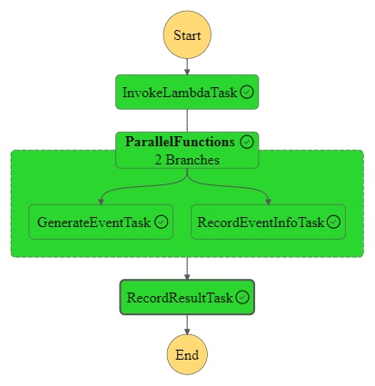

# ICAv2 Event Translator

<!-- TOC -->
* [ICAv2 Event Translator](#ICAv2-Event-Translator)
  * [Inputs](#inputs)
    * [Example Input](#example-input)
  * [Outputs](#outputs)
  * [Step function for event translation](#Step-function-for-event-translation)
    * [Translate ICAv2 event to Orcabus internal event](#Translate-ICAv2-event-to-Orcabus-internal-event)
    * [Save this translation to dynamoDB](#Save-this-translation-to-dynamoDB)
    * [Publish the Orcabus event to event bus](#Publish-the-Orcabus-event-to-event-bus)
  * [Lambda in this directory](#lambda-in-this-directory)
    * [Verify the input event](#Verify-the-input-event)
    * [Generate the rquired event metadate](#Generate-the-rquired-event-metadate)
  * [SSM Parameters](#ssm-parameters)
    * [External Parameters required by CDK](#external-parameters-required-by-cdk)
<!-- TOC -->


## Inputs

The AWS Step functions takes in the following parameters and verify specific parmaters:

* eventCode is ICA_EXEC_028
* eventParameters.analysisStatus is SUCCEEDED
* payload.pipeline.id is "bf93b5cf-cb27-4dfa-846e-acd6eb081aca" - this is currently hardcoded
* Can use a regex on the userReference attribute like `(\d{6}_[A|B]\d+_\d{4}_\w+)`

### Example Input

```json5
{
  "correlationId": "xxxxxx-xxxxxx-xxxxxx-xxxxxx-xxxxxx",
  "timestamp": "2024-03-25T10:07:09.990Z",
  "eventCode": "IXX_EXXX_XXX",
  "eventParameters": {
    "pipelineExecution": "xxxxxx-xxxxxx-xxxxxx-xxxxxx-xxxxxx",
    "analysisPreviousStatus": "INPROGRESS",
    "analysisStatus": "SUCCEEDED"
  },
  "description": "Analysis status changed",
  "projectId": "xxxxxx-xxxxxx-xxxxxx-xxxxxx-xxxxxx",
  "payloadVersion": "v3",
  "payload": {
    "id": "xxxxxx-xxxxxx-xxxxxx-xxxxxx-xxxxxx",
    "timeCreated": "2024-03-25T08:04:40Z",
    "timeModified": "2024-03-25T10:07:06Z",
    "ownerId": "xxxxxx-xxxxxx-xxxxxx-xxxxxx-xxxxxx",
    ...
    "reference": "xxxxxx_xxxxxx_xxxxxx_xxxxxx_xxx_xxxxx-BclConvert vx_x_x-xxxxxx-xxxxxx-xxxxxx-xxxxxx-xxxxxx",
    "userReference": "xxxxxx_xxxxxx_xxxxxx_xxxxxx_xxx_xxxxxxxxxx",
    "pipeline": {
      ...
    },
    "workflowSession": {
      ...
      "status": "INPROGRESS",
      "startDate": "2024-03-25T07:57:48Z",
      "summary": "",
      "tags": {
        ...
      }
    },
    "status": "SUCCEEDED",
    "startDate": "2024-03-25T08:04:51Z",
    "endDate": "2024-03-25T10:07:05Z",
    "summary": "",
    "analysisStorage": {
      ....
    },
    ....
  }
}
```

## Outputs

The AWS Step functions returns the following parameters:

* projectId ->  "bxxxxxxxx-dxxx-4xxxx-adcc-xxxxxxxxx"
* analysisId->  "0xxxxxxx-ddxxx-xxxxx-bxx-5xxxxxxx" (payload.id)
* instrumentRunId -> "2xxxxxxxxx_Axxxxxx_0xxxx_Bxxxx" (from userReference)

* tags (workflow session tags)
```json5
{
  "projectId": "bxxxxxxxx-dxxx-4xxxx-adcc-xxxxxxxxx",
  "analysisId": "0xxxxxxx-ddxxx-xxxxx-bxx-5xxxxxxx",
  "instrumentRunId": "2xxxxxxxxx_Axxxxxx_0xxxx_Bxxxx",
  
  "tags": {
        ...
      }
}
```

## Step function for event translation


### Translate ICAv2 event to Orcabus internal event
combine the iput and anylsis result to generat the orcabus internal event.

### Save this translation process to dynamoDB
send the input and orcabus event to the dynao db for recording of the process

### Publish the Orcabus event to event bus
publish the Orcabus event back the event bridge


## Lambda in this directory

### Verify the input event

### Generate the rquired event metadate

## SSM Parameters 

### External Parameters required by CDK

```
/umccr/orcabus/stateful/eventbridge
```