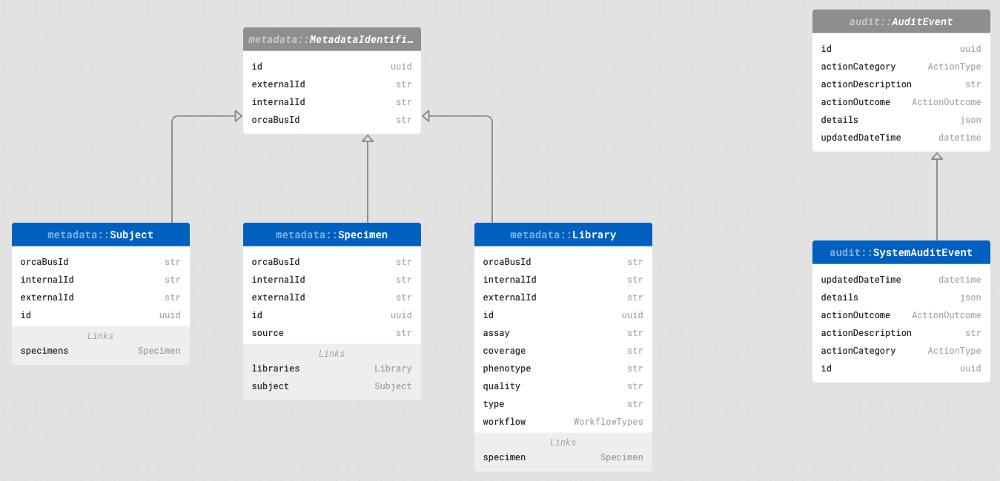
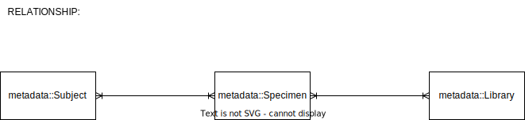

# Metadata Manager for OrcaBus

One of the microservices in the Orcabus handles all the metadata information.

## Schema

The EdgeDb schema looks like this as follows. You could also open this view with the make command: `make edgedb-ui` (see development
section below)



Relationship between schema



The mapping between the metadata spreadsheet to the schema are
| Metadata Header   | Table                | Field Name |
|-------------------|----------------------|------------|
| SubjectID         | `metadata::Subject`  | internalId |
| ExternalSubjectID | `metadata::Subject`  | externalId |
| SampleID          | `metadata::Specimen` | internalId |
| ExternalSampleID  | `metadata::Specimen` | externalId |
| Source            | `metadata::Specimen` | source     |
| LibraryID         | `metadata::Library`  | internalId |
| Phenotype         | `metadata::Library`  | phenotype  |
| Quality           | `metadata::Library`  | quality    |
| Type              | `metadata::Library`  | type       |
| Assay             | `metadata::Library`  | assay      |
| Workflow          | `metadata::Library`  | workflow   |
| Coverage (X)      | `metadata::Library`  | coverage   |

Notes:

- The `orcabusId` is constructed uniquely for ocabusId with the structure of prefixes either `spc.`, `lib.`, `sbj.`
  (for specimen, library, and subject, respectively) and followed by [ulid](https://github.com/ulid/spec) id.

  e.g. `sbj.01HF6B4D6GHCYT3ZVF0S6087W3`
- The audit event schema will record the generation of success/failure of an insertion/deletion.
  
  ```curl
  select audit::AuditEvent {*} filter .id=<uuid>'04ec4232-82be-11ee-870c-6b78b11f565f';
  {
    audit::SystemAuditEvent {
      id: 04ec4232-82be-11ee-870c-6b78b11f565f,
      actionCategory: C,
      actionDescription: 'Insert new subject record: sbj.01HF6B4DJPWGYZK8RZDN9BK454',
      actionOutcome: success,
      details: Json("{\"id\": \"04f3ea1e-82be-11ee-870c-4f6a4d334d37\", \"orcaBusId\": \"sbj.01HF6B4DJPWGYZK8RZDN9BK454\", \"externalId\": \"EXTSUB002\", \"internalId\": \"SBJ220002\"}"),
      updatedDateTime: <datetime>'2023-11-14T07:18:33.366109Z',
    },
  }
  ```


## Local Deployment

Requirement:

- Docker
- Node.js with Yarn

```bash
docker -v
Docker version 20.10.12, build e91ed5707e

node -v
v20.9.0
```

### Installation

To install dependency, yarn is needed for this purpose

```bash
npm i -g yarn
```

To install all dependencies, a make file is provided and can be done by:

```bash
make install
```

### Start


To start the database and server use the following make command. This will run the server and database in
docker-compose. The server will run at port 8080. (http://localhost:8080).
The database used here is [EdgeDb](https://www.edgedb.com/) which is a graph-relational database that uses SQL as their
underlying database. The configuration for this has been bundled up into a docker-compose and could be run as follows.

```bash
make up
```


To start the server up use the following command

```bash
make start
```

We could also start data by resetting and inserting some mock test data.

```bash
make start-scenario-1
```

This should run at localhost port 8080. Valid endpoints are as follows

```bash

http://localhost:8080/subject
http://localhost:8080/library
http://localhost:8080/specimen


<!-- GraphQL -->
http://localhost:8080/graphql/explore (UI)
http://localhost:8080/graphql (Only for graphql POST method)
```

If you need to serve from existing metadata locally. You could copy and paste
the `.xlsx` file into [./src/test-data/scenarios/metadata.xlsx](./src/test-data/scenarios/metadata.xlsx).
Then to dump and reload with this metadata spreadsheet run the following:

```bash
make insert-scenario-2
```

### Testing

```bash
make test

Test Suites: 2 passed, 2 total
Tests:       6 passed, 6 total
Snapshots:   0 total
Time:        36.073 s
```

### Build

To build for deployment the following will generate assets that could be deployed to lambdas.
For more details on the deployment [deploy-readme](./deploy/README.md).

```bash
make build 
```

### Development

edgedb-cli is expected to be installed in the dev environment. See the [installation guide](https://www.edgedb.com/install#macos-homebrew) for details.

Homebrew user:

```curl
brew tap edgedb/tap
brew install edgedb-cli
```

Since the EdgeDb is running in a container, some EdgeDb commands will need to pass in their connection parameter
to get connected with the container. Some make commands are added in the makefile for convenience.

List available makefile command equivalent to edgedb-cli:

- `make edgedb` (`edgedb`)- to run EdgeDb
- `make edgedb-ui` (`edgedb ui`) - to open EdgeDb UI (username: `orcabus_admin`; password: `admin`) // pragma: allowlist secret
- `make edgedb-migrate` (`edgedb migrate`) - to apply new migration
- `make edgedb-migration-create` (`edgedb migration create`) - to create new migrations
- `make edgetypes` - to make EdgeDb files (e.g. `*.edgeql`) recognizable by typescript
