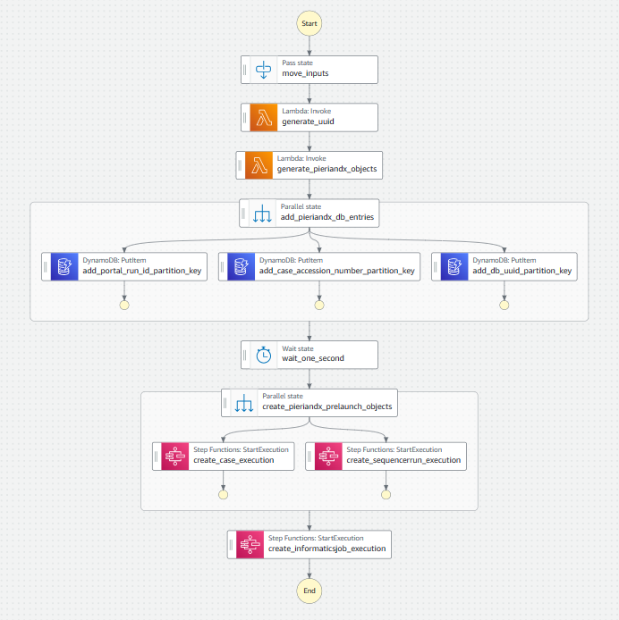
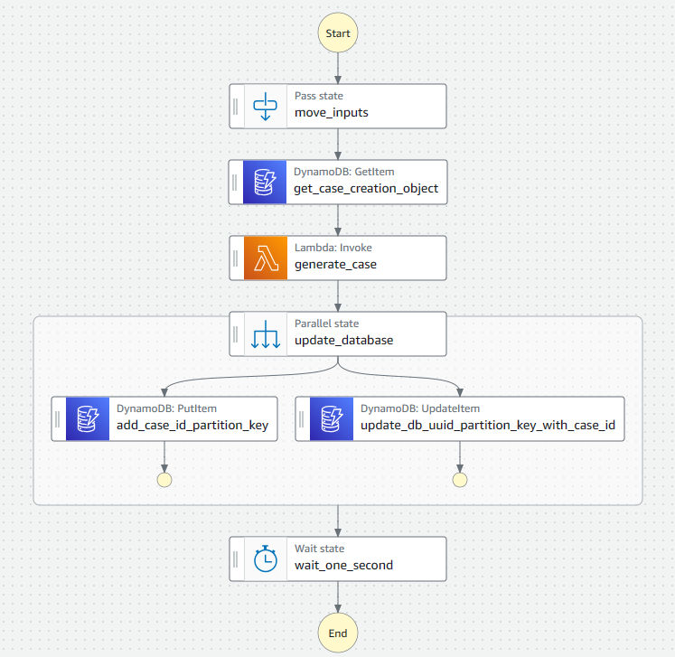
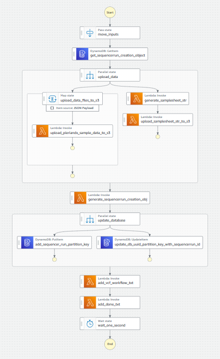
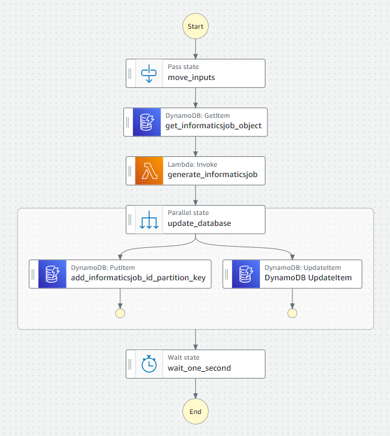

# PierianDx Pipeline Manager

Giant, serverless pipeline attached to a serverless database

## Using the AWS Launch Step function

The AWS Launch step function takes in the following inputs

* dag: Object
  * name: string  # The name of this case dag
  * description: string  # The description of this case dag
* case_metadata: Object
  * panel_name: string  # The name of this case’s panel _tso500_DRAGEN_ctDNA_v2_1_Universityofmelbourne_
  * specimen_label: string  # The label of the specimen  _primarySpecimen_
  * sample_type: Enum  # patientcare, clinical_trial, validation, proficiency_testing
  * indication: String  # Optional input
  * disease: Object
    * code: string  # The disease id
    * label: string  # The name of the disease (optional)
  * is_identified: bool  # Boolean  is this a boolean identified case or de-identified case
  * case_accession_number: string - must be unique - uses syntax SBJID__LIBID__NNN
  * specimen_type:
    * code: string   # The SNOMED-CT term for a specimen type
    * label: Optional label for the specimen type
  * external_specimen_id: string  # The external specimen id  
  * date_accessioned: Datetime  # The date the case was accessioned  _2021-01-01T00:00:00Z_
  * date_collected:  Datetime  # The date the specimen was collected  _2021-01-01T00:00:00Z_
  * date_received:  Datetime  # The date the specimen was received  _2021-01-01T00:00:00Z_
  * gender:  Enum  # unknown, male, femail, unspecified, other, ambiguous, not_applicable  # Optional
  * ethnicity:  Enum  # unknown, hispanic_or_latino, not_hispanic_or_latino, not_reported  # Optional
  * race:  Enum  # american_indian_or_alaska_native, asian, black_or_african_american, native_hawaiian_or_other_pacific_islander, not_reported, unknown, white  # Optional
   
  > Note: If the case is de-identified, the following fields are required
  * study_id:  String  # Only required if is_identified is false
  * participant_id:  String  # Only required if is_identified is false
  
  > Note: If the case is identified, the following fields are required
  * date_of_birth:  Datetime  # Only required if is_identified is true
  * first_name:  String  # Only required if is_identified is true
  * last_name:  String  # Only required if is_identified is true
  * medical_record_numbers:  Object  # Only required if is_identified is true
    * mrn: string  # The medical record number
    * medical_facility: Object
      * facility: string  # The name of the facility 
      * hospital_number: string  # The hospital number
  * requesting_physicians:  Object  # The requesting physician - required for identified cases
    * first_name: string
    * last_name: string

* data_files:  Object
  * microsat_output:  uri
  * tmb_metrics:  uri
  * cnv:  uri
  * hard_filtered:  uri
  * fusions:  uri
  * metrics_output:  uri

* samplesheet_b64gz:  str
* portal_run_id:  str
* sequencerrun_s3_path_root:  str

## DataBase Structure

> IDs
* db_uuid
* portal_run_id
* case_id
* sequencerun_id
* informaticsjob_id
* report_id
* case_accession_number

> Objects
* samplesheet_b64gz:  str
* case_creation_obj:  CaseCreationObject
* sequencerrun_creation_obj:  SequencerRunCreationObject
* informaticsjob_creation_obj:  InformaticsJobCreationObject
* data_files: List[DataFileObject]

> Status
* job_status:  waiting, ready, running, complete, failed, canceled
* report_status:  waiting, ready, running, complete, failed, canceled, report_generation_complete

## Step Function execution structure

### Launch Overview

This will trigger three sub-step-functions, case creation, sequencerrun creation and informatics job creation



The whole process should not take more than 30 seconds

### Case Creation Overview

Generate the case object, this defines the case metadata and will generate a case id (required for the informatics job section)



### Sequencer Run Overview

Upload the data files from ICAv2 to the PierianDx S3 bucket.

Generate a samplesheet and upload it to the PierianDx S3 bucket.

Create a sequencer run object, this defines the sequencer run metadata and will generate a sequencer run id (required for the informatics job section)



### Informatics Job Overview

Generate an informatics job for the case. 

This will return an informatics job id. 




## Launch Execution Example

```
DEV_EXECUTION_ARN="arn:aws:states:ap-southeast-2:843407916570:execution:orcabusPieriandxDevpieriandxlaunchstepfunctionsstatemachine0ED802CE-IZY6zTTcvUSJ:99ce53cd-cc62-4516-ad58-98e2e78527eb"
aws stepfunctions start-execution \
  --state-machine-arn "${DEV_EXECUTION_ARN} \
  --input "$( \
    jq --raw-output --null-input \
      '
        {
          "dag": {
            "name": "cromwell_tso500_ctdna_workflow_1.0.4",
            "description": "tso500_ctdna_workflow"
          },
          "case_metadata": {
            "panel_name": "tso500_DRAGEN_ctDNA_v2_1_Universityofmelbourne",
            "specimen_label": "primarySpecimen",
            "sample_type": "patientcare",
            "indication": "Test",
            "disease": {
              "code": "64572001",
              "label": "Disease"
            },
            "is_identified": true,
            "case_accession_number": "SBJ04405__L2301368__ot__011",
            "specimen_type": {
              "code": "122561005",
              "label": "Blood specimen from patient"
            },
            "external_specimen_id": "externalspecimenid",
            "date_accessioned": "2021-01-01T00:00:00Z",
            "date_collected": "2024-02-20T20:17:00Z",
            "date_received": "2021-01-01T00:00:00Z",
            "date_of_birth": "1970-01-01",
            "first_name": "John",
            "last_name": "Doe",
            "medical_record_numbers": {
              "mrn": "3069999",
              "medical_facility": {
                "facility": "Not Available",
                "hospital_number": "99"
              }
            },
            "requesting_physician": {
              "first_name": "Meredith",
              "last_name": "Gray"
            }
          },
          "data_files": {
            "microsat_output": "icav2://7595e8f2-32d3-4c76-a324-c6a85dae87b5/ilmn_cttso_outputs/v2_1_1/20240404abcd0001/Logs_Intermediates/DragenCaller/L2301368/L2301368.microsat_output.json",
            "tmb_metrics": "icav2://7595e8f2-32d3-4c76-a324-c6a85dae87b5/ilmn_cttso_outputs/v2_1_1/20240404abcd0001/Logs_Intermediates/Tmb/L2301368/L2301368.tmb.metrics.csv",
            "cnv": "icav2://7595e8f2-32d3-4c76-a324-c6a85dae87b5/ilmn_cttso_outputs/v2_1_1/20240404abcd0001/Results/L2301368/L2301368.cnv.vcf",
            "hard_filtered": "icav2://7595e8f2-32d3-4c76-a324-c6a85dae87b5/ilmn_cttso_outputs/v2_1_1/20240404abcd0001/Results/L2301368/L2301368.hard-filtered.vcf",
            "fusions": "icav2://7595e8f2-32d3-4c76-a324-c6a85dae87b5/ilmn_cttso_outputs/v2_1_1/20240404abcd0001/Results/L2301368/L2301368_Fusions.csv",
            "metrics_output": "icav2://7595e8f2-32d3-4c76-a324-c6a85dae87b5/ilmn_cttso_outputs/v2_1_1/20240404abcd0001/Results/L2301368/L2301368_MetricsOutput.tsv"
          },
          "samplesheet_b64gz": "H4sIAAAAAAAAA42SX0vDMBTF3/cpRp4VktY5/zyFCUXQIto9iEjI7N0abNItyYZj7Lt7065rh3uQ0tLc37npybndDYZDUoDMwZK74Q5XuJ6rEsS8slp6sQHrVGUQRhcNtWsjjNSAJZK5lblMYfaa8ihmjMWXz08Ab9mrYNdptYlicmhSxnm71mC88Ntl3YtcvsGKoGAfVMSiDde5CEvBxNf2q4RQZiN20SPROaJMDj8nTfSE9Jvo8cPeVSNKS+HAe2UWPQ8yl0sPVjRegutJlmQTvDKe8Qle+Nqe8UQc/VM8g0JuVLUO8RNvlW4FWhml11qEmoa82bUEs/AFSuNRK5PuW7iisl60+R1ZhcOzKofu0GQ6Ttk7u4rvHxmt77ZA/qSRSy+x5aPeq8kDqZN6iX+HysNuT1FMWXx9c/Dc4XbGDynvWClNKLJjoZ5JkCUck+JJxhNyCpsUkWJ0nE96dCyaiTZGpg8vlNLbHh+d5TXe4/NzsB/8AvJdybj8AgAA",
          "sequencerrun_s3_path_root": "s3://pdx-cgwxfer-test/melbournetest",
          "instrument_run_id": "231116_A01052_0172_BHVLM5DSX7",
          "portal_run_id": "20240415abcd0011"
        }
      ' \
  )"
```