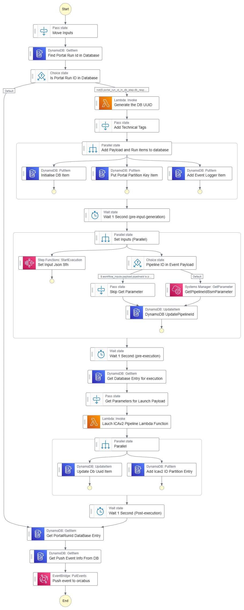
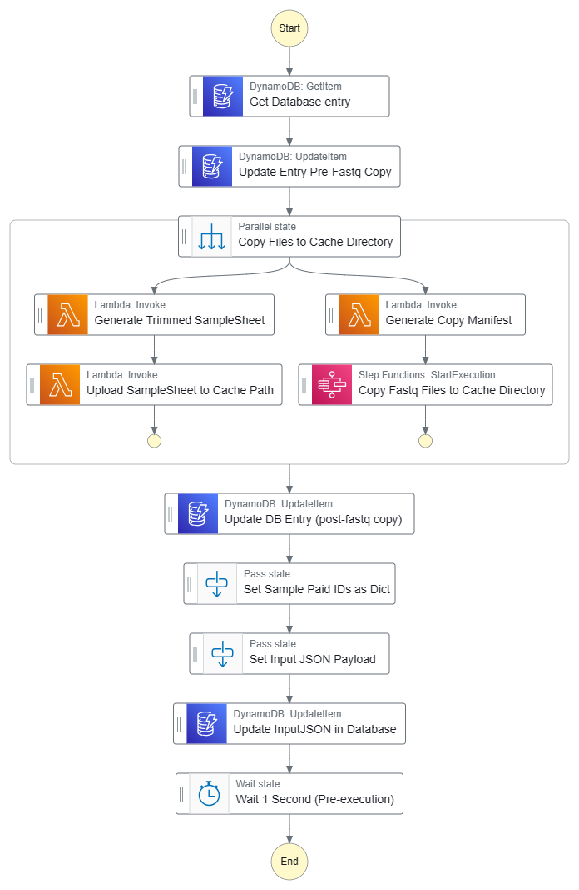
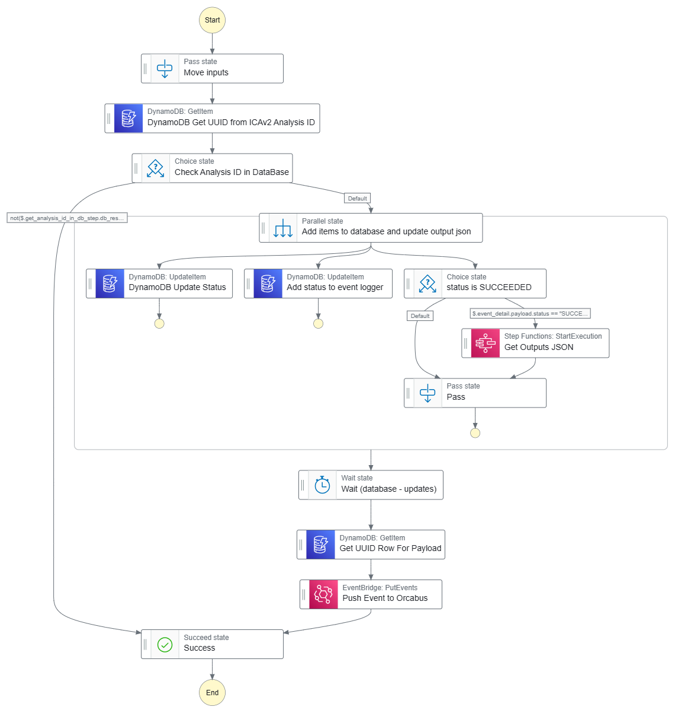
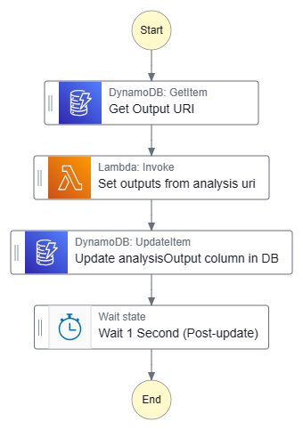

# BCLConvert Interop QC Pipeline Manager

<!-- TOC -->
* [BCLConvert Interop QC Pipeline Manager](#bclconvert-interop-qc-pipeline-manager)
  * [StepFunctions Layout](#stepfunctions-layout)
    * [Workflow Run Manager Event Handler SFN](#workflow-run-manager-event-handler-sfn)
    * [BCLConvert InterOp QC Configure Inputs SFN](#bclconvert-interop-qc-configure-inputs-sfn)
    * [Handle ICAv2 External Event SFN](#handle-icav2-external-event-sfn)
    * [BCLConvert InterOp QC Configure Outputs SFN](#bclconvert-interop-qc-configure-outputs-sfn)
  * [Launch Inputs (via events)](#launch-inputs-via-events)
    * [Example Launch Event Payload](#example-launch-event-payload)
    * [Launching via the event](#launching-via-the-event)
  * [Outputs](#outputs)
  * [Monitoring workflows](#monitoring-workflows)
    * [Example external icav2 event](#example-external-icav2-event)
    * [Example internal published event](#example-internal-published-event)
    * [Termination event](#termination-event)
      * [Success event](#success-event)
      * [Fail event](#fail-event)
  * [Lambdas in this directory](#lambdas-in-this-directory)
    * [set_outputs_json_py](#set_outputs_json_py)
    * [External Parameters required by this CDK Stack](#external-parameters-required-by-this-cdk-stack)
  * [SSM Parameters](#ssm-parameters-)
  * [Secrets](#secrets)
<!-- TOC -->

This BCLConvert InterOpQC Pipeline Manager performs the following actions

* Subscribes to the workflow run manager EventBus source (orcabus.wfm)
* Waits for a workflow run manager event to be published with the 'READY' status where the workflow type is set to `bclconvert_interop_qc`
* Launches the bclconvert interop qc CWL pipeline on ICAv2
* Tracks the status of the pipeline run through ICAv2 events. 
* Logs launches, intermediate status changes and completions in a DynamoDB database.  

## StepFunctions Layout

### Workflow Run Manager Event Handler SFN

> Handles events from the workflow run manager 

Triggered when status is set to `ready` and the workflow type is set to `bclconvert_interop_qc`

<details>

<summary>Click to view graph</summary>



</details>


### BCLConvert InterOp QC Configure Inputs SFN

> Required by the WFM SFN

This is a custom step function specific to this BCLConvert InteropQC stack.  
Given the database UUID, generate the inputs-json for this workflow from parameters in the wfm payload.  

<details>

<summary>Click to view graph</summary>



</details>

An example input json might as below:

<details>

<summary>Click to expand!</summary>

```json
{
  "bclconvert_report_directory": {
    "class": "Directory",
    "location": "icav2://7595e8f2-32d3-4c76-a324-c6a85dae87b5/ilmn_primary/2023/231116_A01052_0172_BHVLM5DSX7/3661659/20240307abcd7890/Reports/"
  },
  "interop_directory": {
    "class": "Directory",
    "location": "icav2://7595e8f2-32d3-4c76-a324-c6a85dae87b5/ilmn_primary/2023/231116_A01052_0172_BHVLM5DSX7/3661659/20240307abcd7890/InterOp/"
  },
  "run_id": "231116_A01052_0172_BHVLM5DSX7"
}
```

</details>


### Handle ICAv2 External Event SFN

> Handles events from the ICAv2 event bus

Triggered when the ica-event code is set to ICA_EXEC_028 (workflow run state change).  
This will be triggered for analysis runs that do not relate to this workflow as well.  
The step function will first check the database to see if the analysis id is related to this workflow and exit if not.  

If the analysis id is related to this workflow, then publish an internal event with the status of the analysis is published.

If the analysis is in a terminal state, then the internal event will be published with the outputs of the analysis or the error code :construction:

<details>

<summary>Click to view graph</summary>



</details>

### BCLConvert InterOp QC Configure Outputs SFN

> Required by the ICAv2 External Event Handler SFN

This is a custom step function specific to this BCLConvert InteropQC stack. 
This is only called if the icav2 external event handler sfn determines the analysis is in a successful terminal state (SUCCEEDED).  

This step function will take the db uuid, find the analysis output uri, and generate the outputs json for the analysis.

<details>

<summary>Click to view graph</summary>



</details>

An output json might be as shown below

<details>

<summary>Click to expand!</summary>

```json
{
  "multiqcOutputDir": "icav2://7595e8f2-32d3-4c76-a324-c6a85dae87b5/interop_qc/1_3_1__1_2_1/202405142871bfae/out/multiqc/",
  "multiqcHtmlReport": "icav2://7595e8f2-32d3-4c76-a324-c6a85dae87b5/interop_qc/1_3_1__1_2_1/202405142871bfae/out/multiqc/231116_A01052_0172_BHVLM5DSX7_multiqc_report.html",
  "interopOutputDir": "icav2://7595e8f2-32d3-4c76-a324-c6a85dae87b5/interop_qc/1_3_1__1_2_1/202405142871bfae/out/interop_summary_files/"
}
```

</details>

## Launch Inputs (via events)

In the top level of the payload we require the following values

* detail-type - The type of event, this should be set to workflowRunStateChange
* source - The source of the event, this should be set to orcabus.wfm

The AWS Step functions requires the following event detail information

* status - The status of the workflow run manager event (should be 'READY')
* workflowType - this MUST be set to bclconvert_interop_qc
* workflowVersion - Not currently used, set to 1.0.0
* portalRunId - This is required to be set to a unique identifier for the run
* payload
  * refId: This is not tracked by this service, only by the workflow run manager service
  * version: The service version, not currently used, set to 0.1.0
  * projectId: The icav2 project id
  * userReference: The user reference for the icav2 pipeline
  * bclconvertReportDirectory: The icav2 uri that the report directory resides at 
  * interopDirectory: The icav2 uri that the interop directory resides at
  * instrumentRunId: The illumina instrument run id
  * analysisOutputUri: The icav2 uri that the analysis output should be stored at
  * icaLogsUri: The icav2 uri that the ica logs should be stored at (note that this currently doesn't work) - see https://github.com/umccr-illumina/ica_v2/issues/184 for more info
  * userTags: A dictionary of user tags that should be added to the analysis
    * This might include
      * The instrument run id
      * The project name


### Example Launch Event Payload

<details>

<summary>Click to expand! </summary>

```json
{
    "version": "0",
    "id": "2ce3c70c-e757-6246-5783-a83543d87ea7",
    "detail-type": "workflowRunStateChange",
    "source": "orcabus.wfm",
    "account": "843407916570",
    "time": "2024-05-10T08:25:12Z",
    "region": "ap-southeast-2",
    "resources": [],
    "detail": {
        "status": "ready",
        "workflowType": "bclconvert_interop_qc",
        "workflowVersion": "1.3.1--1.2.1",
        "portalRunId": "20240510abcd0030",
        "payload": {
            "refId": "abc",
            "version": "0.1.0",
            "projectId": "7595e8f2-32d3-4c76-a324-c6a85dae87b5",
            "userReference": "bclconvert_interop__semi_automated__umccr__pipeline",
            "bclconvertReportDirectory": "icav2://7595e8f2-32d3-4c76-a324-c6a85dae87b5/ilmn_primary/2023/231116_A01052_0172_BHVLM5DSX7/3661659/20240307abcd7890/Reports/",
            "interopDirectory": "icav2://7595e8f2-32d3-4c76-a324-c6a85dae87b5/ilmn_primary/2023/231116_A01052_0172_BHVLM5DSX7/3661659/20240307abcd7890/InterOp/",
            "instrumentRunId": "231116_A01052_0172_BHVLM5DSX7",
            "analysisOutputUri": "icav2://7595e8f2-32d3-4c76-a324-c6a85dae87b5/interop_qc/20240510abcd0030/out/",
            "icaLogsUri": "icav2://7595e8f2-32d3-4c76-a324-c6a85dae87b5/interop_qc/20240510abcd0030/logs/",
            "userTags": {
                "projectname": "trial"
            }
        }
    }
}
```

</details>


### Launching via the event

> A scripted example

<details>

<summary>Click to expand! </summary>

```shell
# Workflow Input
report_uri="icav2://7595e8f2-32d3-4c76-a324-c6a85dae87b5/ilmn_primary/2023/231116_A01052_0172_BHVLM5DSX7/3661659/20240307abcd7890/Reports/"
interop_uri="icav2://7595e8f2-32d3-4c76-a324-c6a85dae87b5/ilmn_primary/2023/231116_A01052_0172_BHVLM5DSX7/3661659/20240307abcd7890/InterOp/"
run_id="231116_A01052_0172_BHVLM5DSX7"
output_root_uri="icav2://7595e8f2-32d3-4c76-a324-c6a85dae87b5/interop_qc/1_3_1__1_2_1/"
project_id="7595e8f2-32d3-4c76-a324-c6a85dae87b5"  # trial

# Event metadata
portal_run_id="$(date --utc +%Y%m%d)$(xxd -l 4 -c 4 -p < /dev/random)"
utc_time="$(date --utc --iso-8601=seconds | sed 's/+00:00/Z/')"

# Generate the input payload
input_payload="$( \
  jq --null-input --raw-output \
    --arg project_id "${project_id}" \
    --arg portal_run_id "${portal_run_id}" \
    --arg report_uri "${report_uri}" \
    --arg interop_uri "${interop_uri}" \
    --arg run_id "${run_id}" \
    --arg output_root_uri "${output_root_uri}" \
    '
      {
        "refId": null,
        "version": "0.1.0",
        "projectId": $project_id,
        "userReference": "bclconvert_interop__semi_automated__umccr__pipeline__\($portal_run_id)",
        "bclconvertReportDirectory": $report_uri,
        "interopDirectory": $interop_uri,
        "instrumentRunId": $run_id,
        "analysisOutputUri": "\($output_root_uri)\($portal_run_id)/out/",
        "icaLogsUri": "\($output_root_uri)\($portal_run_id)/logs/",
        "userTags": {
          "projectname": "trial"
        }
      } 
    '
)"

# Generate the input detail
input_detail="$(
  jq --null-input --raw-output \
    --arg portal_run_id "${portal_run_id}" \
    --argjson input_payload "${input_payload}" \
    '
      {
        "status": "ready",
        "portalRunId": $portal_run_id,
        "workflowType": "bclconvert_interop_qc",
        "workflowVersion": "1.3.1--1.2.1",
        "payload": $input_payload
      }
    '
)"
  
# Generate the event entry
event_entry="$(
  jq --null-input --raw-output --compact-output \
    --arg portal_run_id "$portal_run_id" \
    --arg utc_time "$utc_time" \
    --argjson input_detail "$input_detail" \
    '
      {
        "Entries": [
          {
            "EventBusName": "OrcaBusMain",
            "DetailType": "workflowRunStateChange",
            "Source": "orcabus.wfm",
            "Time": $utc_time,
            "Resources": [],
            "Detail": ( $input_detail | tojson )
          }
        ]
      }
    ' \
)"
  
# Push the event to the event bus
aws events put-events --cli-input-json "${event_entry}"
```

</details>

## Outputs

The AWS Step functions final step is generating a put-event with the payload (with the analysis id).  

This put payload looks something like the following:

<details>

<summary>Click to expand!</summary>

```json5
{
    "version": "0",
    "id": "90916b28-8649-5aa4-a779-c7a7939088bb",
    "detail-type": "workflowRunStateChange",
    "source": "orcabus.bclconvert_interop_qc",
    "account": "843407916570",
    "time": "2024-05-13T00:24:02Z",
    "region": "ap-southeast-2",
    "resources": [
        "arn:aws:states:ap-southeast-2:843407916570:stateMachine:bclconvertInteropQcSfn-wfm-ready-event-handler",
        "arn:aws:states:ap-southeast-2:843407916570:execution:bclconvertInteropQcSfn-wfm-ready-event-handler:36477523-4aa5-82c7-923a-14e1ecb93786_ddaeea43-84e7-08e0-bd70-f0673fcc8c89"
    ],
    "detail": {
        "workflowType": "bclconvert_interop_qc",
        "workflowVersion": "1.3.1--1.21",
        "payload": {
            "refId": null,
            "version": "2024.05.07",
            "analysisId": "d63dc6c7-690a-4d17-8fd1-e4556a2ef1e0",
            "analysisOutput": "",
        },
        "portalRunId": "20240513a3fb6502",  /* pragma: allowlist secret */
        "timestamp": "2024-05-13T00:24:01.812Z",
        "status": "REQUESTED"
    }
}
```

</details>

## Monitoring workflows

This stack also creates a icav2 external event handler that will track any events that are published to the event bus.

This will trigger the tracking step function to launch, this will first look for the analysis id in the payload of the event in the
BclConvert InterOp QC Database and determine if this analysis is part of this service.  

If the analysis ID is not found in the database, no action is required, 
if so, then publish an internal event displaying the analysis' status for the portal run id.  
In the event that the analysis is in a terminal state (successful), then the internal event will be published with the outputs of the analysis.
In the event that the analysis is in a terminal state (failure), then the internal event will be published with error information :construction:

### Example external icav2 event

<details>

<summary>Click to expand!</summary>

```json
{
    "version": "0",
    "id": "1294b95b-4bb6-ff11-fdc5-f57af2928c64",
    "detail-type": "Event from aws:sqs",
    "source": "Pipe IcaEventPipeConstru-aVEAl34nl7zf",
    "account": "843407916570",
    "time": "2024-05-13T00:24:07Z",
    "region": "ap-southeast-2",
    "resources": [],
    "detail": {
        "ica-event": {
            "correlationId": "0e28d39b-a2cc-4e9b-86f2-78db22a25891",
            "timestamp": "2024-05-13T00:24:06.929Z",
            "eventCode": "ICA_EXEC_028",
            "eventParameters": {
                "pipelineExecution": "d63dc6c7-690a-4d17-8fd1-e4556a2ef1e0",
                "analysisPreviousStatus": "QUEUED",
                "analysisStatus": "INITIALIZING"
            },
            "description": "Analysis status changed",
            "projectId": "7595e8f2-32d3-4c76-a324-c6a85dae87b5",
            "payloadVersion": "v4",
            "payload": {
                "id": "d63dc6c7-690a-4d17-8fd1-e4556a2ef1e0",
                "timeCreated": "2024-05-13T00:23:58Z",
                "timeModified": "2024-05-13T00:24:06Z",
                "owner": {
                    "id": "a9938581-7bf5-35d2-b461-282f34794dd1"
                },
                "tenant": {
                    "id": "1555b441-c3be-40b0-a8f0-fb9dc7500545",
                    "name": "umccr-prod"
                },
                "reference": "bclconvert_interop__semi_automated__umccr__pipeline__20240513a3fb6502-bclconvert-interop-qc__1_3_1--1_21__20240313015132-061f2f50-44b2-4606-a8ce-7b87c302848f",
                "userReference": "bclconvert_interop__semi_automated__umccr__pipeline__20240513a3fb6502",
                "pipeline": {
                    "id": "f606f580-d476-47a8-9679-9ddb39fcb0a8",
                    "urn": "urn:ilmn:ica:pipeline:f606f580-d476-47a8-9679-9ddb39fcb0a8#bclconvert-interop-qc__1_3_1--1_21__20240313015132",
                    "timeCreated": "2024-03-13T01:53:51Z",
                    "timeModified": "2024-03-13T01:53:51Z",
                    "owner": {
                        "id": "a9938581-7bf5-35d2-b461-282f34794dd1"
                    },
                    "tenant": {
                        "id": "1555b441-c3be-40b0-a8f0-fb9dc7500545",
                        "name": "umccr-prod"
                    },
                    "code": "bclconvert-interop-qc__1_3_1--1_21__20240313015132",
                    "description": "GitHub Release URL: https://github.com/umccr/cwl-ica/releases/tag/bclconvert-interop-qc/1.3.1--1.21__20240313015132",
                    "language": "CWL",
                    "pipelineTags": {
                        "technicalTags": []
                    },
                    "analysisStorage": {
                        "id": "6e1b6c8f-f913-48b2-9bd0-7fc13eda0fd0",
                        "name": "Small",
                        "description": "1.2TB"
                    },
                    "proprietary": false
                },
                "status": "INITIALIZING",
                "summary": "",
                "analysisStorage": {
                    "id": "6e1b6c8f-f913-48b2-9bd0-7fc13eda0fd0",
                    "name": "Small",
                    "description": "1.2TB"
                },
                "analysisPriority": "LOW",
                "tags": {
                    "technicalTags": [
                        "portal_run_id=20240513a3fb6502",
                        "step_functions_execution_arn=arn:aws:states:ap-southeast-2:843407916570:execution:bclconvertInteropQcSfn-wfm-ready-event-handler:36477523-4aa5-82c7-923a-14e1ecb93786_ddaeea43-84e7-08e0-bd70-f0673fcc8c89"
                    ],
                    "userTags": [
                        "projectname=trial"
                    ],
                    "referenceTags": []
                }
            }
        }
    }
}
```

</details>

### Example internal published event

<details>

<summary>Click to expand! </summary>

```json5
{
    "version": "0",
    "id": "a235d43a-4e6a-adb6-4ba1-864d2f4948f8",
    "detail-type": "workflowRunStateChange",
    "source": "orcabus.bclconvert_interop_qc",
    "account": "843407916570",
    "time": "2024-05-13T00:24:09Z",
    "region": "ap-southeast-2",
    "resources": [
        "arn:aws:states:ap-southeast-2:843407916570:stateMachine:bclconvertInteropQcSfn-icav2-external-handler",
        "arn:aws:states:ap-southeast-2:843407916570:execution:bclconvertInteropQcSfn-icav2-external-handler:1294b95b-4bb6-ff11-fdc5-f57af2928c64_04c9b2f6-a009-fef2-fad5-266d3cdda709"
    ],
    "detail": {
        "workflowType": "bclconvert_interop_qc",
        "workflowVersion": "1.3.1--1.21",
        "payload": {
            "refId": null,
            "version": "2024.05.07",
            "analysisId": "d63dc6c7-690a-4d17-8fd1-e4556a2ef1e0",
            "analysisOutput": ""
        },
        "portalRunId": "20240513a3fb6502",  /* pragma: allowlist secret */
        "timestamp": "2024-05-13T00:24:09.472Z",
        "status": "INITIALIZING"
    }
}
```

</details>

### Termination event

If the analysis is in a terminal state, then the internal event will be published with the status of the analysis.

#### Success event

In a success status event, the analysisOutput will be populated with the output uri of the analysis

<details>

<summary>Click to expand!</summary>

```json5
{
    "version": "0",
    "id": "a235d43a-4e6a-adb6-4ba1-864d2f4948f8",
    "detail-type": "workflowRunStateChange",
    "source": "orcabus.bclconvert_interop_qc",
    "account": "843407916570",
    "time": "2024-05-13T00:24:09Z",
    "region": "ap-southeast-2",
    "resources": [
        "arn:aws:states:ap-southeast-2:843407916570:stateMachine:bclconvertInteropQcSfn-icav2-external-handler",
        "arn:aws:states:ap-southeast-2:843407916570:execution:bclconvertInteropQcSfn-icav2-external-handler:1294b95b-4bb6-ff11-fdc5-f57af2928c64_04c9b2f6-a009-fef2-fad5-266d3cdda709"
    ],
    "detail": {
        "workflowType": "bclconvert_interop_qc",
        "workflowVersion": "1.3.1--1.21",
        "payload": {
            "refId": null,
            "version": "2024.05.07",
            "analysisId": "d63dc6c7-690a-4d17-8fd1-e4556a2ef1e0",
            "analysisOutput": "{\"interopOutputDir\":\"icav2://7595e8f2-32d3-4c76-a324-c6a85dae87b5/interop_qc/20240513a3fb6502/out/interop_summary_files/\",\"multiqcHtmlReport\":\"icav2://7595e8f2-32d3-4c76-a324-c6a85dae87b5/interop_qc/20240513a3fb6502/out/multiqc/231116_A01052_0172_BHVLM5DSX7_multiqc_report.html\",\"multiqcOutputDir\":\"icav2://7595e8f2-32d3-4c76-a324-c6a85dae87b5/interop_qc/20240513a3fb6502/out/multiqc/\"}"
        },
        "portalRunId": "20240513a3fb6502",  /* pragma: allowlist secret */
        "timestamp": "2024-05-13T00:24:09.472Z",
        "status": "SUCCEEDED"
    }
}
```

</details>

#### Fail event

:construction:

## Lambdas in this directory

### set_outputs_json_py

The set outputs json python script takes the analysis output uri in as an input and find the 
interop summary results, the multiqc html report and the multiqc output directory.

### External Parameters required by this CDK Stack

## SSM Parameters 

```
/icav2/umccr-prod/bclconvert_interop_qc_pipeline_id
```

## Secrets

* ICAv2JWTKey-umccr-prod-service-trial  # Development
* ICAv2JWTKey-umccr-prod-service-staging  # Staging
* ICAv2JWTKey-umccr-prod-service-prod  # Production
