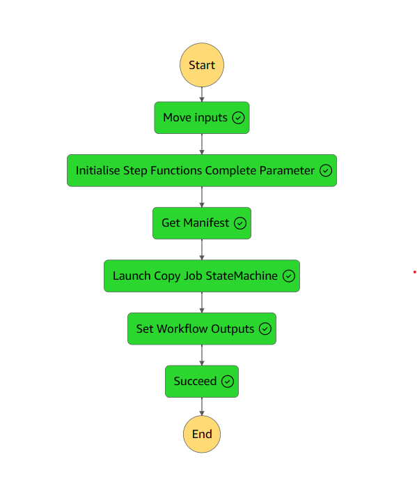

# BSSH Manager

<!-- TOC -->

* [BSSH Manager](#bssh-manager)
    * [Overview](#overview)
    * [Inputs](#inputs)
    * [Outputs](#outputs)
    * [Lambdas in this directory](#lambdas-in-this-directory)
        * [Process BCLConvert Output](#process-bclconvert-output)
    * [SSM Parameters](#ssm-parameters-)
        * [Parameters generated by CDK](#parameters-generated-by-cdk)
        * [External Parameters required by CDK](#external-parameters-required-by-cdk)

<!-- TOC -->

## Overview

The bssh manager runs performs the following logic:

Reads the bssh_output.json file from the BCLConvert run output folder

* Collects the fastq list csv file from the BCLConvert run output folder

* Read and return the fastq list rows as a list of dictionaries (gzip compressed / b64 encoded)



## Inputs

* Statemachine is triggered by a WorkflowRunStateChange event from the workflowmanager:

An example event is shown below:

<details>

<summary>Click to expand!</summary>

```json
{
  "DetailType": "WorkflowRunStateChange",
  "EventBusName": "OrcaBusMain",
  "Source": "orcabus.workflowmanager",
  "Detail": {
    "portalRunId": "20240528da604011",
    "timestamp": "2024-05-28T22:51:22Z",
    "status": "ready",
    "workflowName": "bsshFastqCopy",
    "workflowVersion": "2024.05.24",
    "payload": {
      "refId": "018fc166-a8d2-772a-92e2-1668ee1034d7",
      "version": "2024.05.24",
      "data": {
        "outputUri": "icav2://7595e8f2-32d3-4c76-a324-c6a85dae87b5/ilmn_primary/240229_A00130_0288_BH5HM2DSXC/20240528da604011/",
        "analysisId": "01bd501f-dde6-42b5-b281-5de60e43e1d7",
        "instrumentRunId": "240229_A00130_0288_BH5HM2DSXC",
        "projectId": "b23fb516-d852-4985-adcc-831c12e8cd22"
      }
    }
  }
}
```

</details>

# The important components of the inputs are:

* outputUri - Where the data will be placed
* analysisId - (the analysis id to query in order to collect the location of the fastq list rows csv),
* instrumentRunId - (not used by the step function but parsed for the completion event to tie the fastq list rows to an instrument run id),
* projectId - The bssh project id that ran the analysis id.  
  * This is also the project context that the copy batch data API calls need to be run in.  


## Outputs

We output the fastq list rows in b64gz format.
This is a gzip compressed, base64 encoded string of the fastq list rows dictionary.

```json5
{
  "outputs": {
    "instrumentRunId": "231116_A01052_0172_BHVLM5DSX7",
    // pragma: allowlist secret 
    "fastq_list_rows_b64gz": "H4sIALln6WUC/+Wd32/cNgzH/5Ugz7XPkvyzb66LaQXSl9odBgyD4fO5Q7Dk0l3TDt2w/32kstOtKatLlL7wiD6UTg64fsl+LIqm6F/+Pn9jX708f352bttusK0dWpt2YLZD17Zdqs6fncFH+tf4kQttMmXK+u5nFy/wZ2+3v29v/txeXK530+4z/uZi2i7wG4UfWqaN+uHyann75lW/m/Hzl/P0ST9frdbavFsXqkw2daGTvKmLZNrMc1IbNSu91PNG69Xl1fU2mbbT1ecPy4eVNkqpcmwzlRV6zFSlxxc//nTxunjZ/1yNG52XhRrzuck2c/Jivuputp+W3e3Zp3zUY5WsK9XM9aZJiqXcwBcuZTLV6yWZJ1Wti6XZ5Nl6dfPx9v3H21U/Xb+/gm9EKaNa7XV7Y+zVeJFlanyjRvgrfTd9uP0j/e2v8/8065PWrEnN+zj/X3BVNMVSv9OJ0RuT5HMF3290nszlVBebaanhX+EEj+93l9fw/2elM23ColemLFVZNPjRPDNZNa3nTVU32XeLGgcF92Lwz7OzA8kAcdcCzrZNBzAtcG0HkuRGKMmNN8ZeCyGZ0syL5MdHjYOCEMldB+sxMDx0aQtID+6KIrnKZJJcZd4YeyODZFIzK5IjosZBQYhk6xZlSK5t2lpYkiHFprPrSgkl+WCMfS6EZEozL5IfHzUOCoJr8jAgvsPQph3YsELblsyuKy2UZO2NsS+EkExp5kXy46PGQUF4Tcal2OJC7OpecNXR2bURSrLxxtiXQkimNPMi+fFR46AgXPG6K3nBmoyF62FwZWz9Ncl5Oe6W3cftg3jWp8Lz/sa4V3/vcuwr9LE+WbYfrJ8F598pmtzUBHNywN9trwfcXQ/u8VVL8l+J5r/60sfV3se1EP6P6efF/9OiyU1NcP2HfTjij8+uIZ2HVACyepL/WjT/9Zc+rvc+boTwf0w/L/6fFk1uasI7+c5i+g+LPqCPNwLYAZD8N6L5b770cbP3scqE3ACOOoDXHeCJ8WQnJ5gDtJABdPhsDZ+V48NyuCtQ94Aik3wP2Ku/dwlOVjLuAccdwOoe8NR4spMTuge4XcDgyvjuwRxekfeAKpdJf5V7A1yqZRBPi2ZFeUzcWEgIV/UsZPT4hC51BT0s8pFZfVUIpbnwBrjUCKGZFM2L5oi4sZBwpAMOT5S0Ka7KWKOnSK6FklwX3gB35jJIpkWzIjkmbiwkhHfaWGqzQDIeLIFEmyS5Ekpy5Q1wZyGEZFI0L5Ij4sZCQjDDxjIZZNipdZ1wQ5saguTyQSSbUyF533xUl94Ad7o2JHOyJIdFsyD5KXFjISGYXQ/4B7bHFnPs9hsk10JJrr0B7qyEkEyK5kVyRNxYSAjWsF1Puh1S2CLjU21LktwIJbnxBrizFkIyKZoXyRFxYyEhnF1jI0rbpR3WsWFhpkhuMpkkN5k3wJ2NDJJp0axIjokbCwnh2vXgJiJhd7lrNCdJVkJJVt4Ye50JIZkUzYvkiLixkBA+Kda5iUgplrA7yLVJkrVQkrU3wJ1KCMmkaF4kR8SNhYQj3SEtjix0nV5YxyZJNkJJPhjgTi2EZFI0L5Ij4sZCQrDihR2beGB7uGvbprPrQijJhTfAnUYIyaRoXiRHxI2FhCPzCl3TJvZrWpdm51+TrB+2T85PheR936tW3gB3ukab/GRJDotmQfJT4sZCQnhNxuJ112F23brSF0WyFkqy9ga4sxBCMimaF8kRcWMhIVi7xsH+kFWnbkgKrMokyUYoycYb4M5SCMmkaF4kR8SNhYQjfdd4wBFnnN1NOyJJzoWSfDDAnZUQkknRvEiOiBsLCeF5RTimaLBp2+H40W/skwuhJBfeAHfWQkgmRfMiOSJuLCQEs2s3bBRPNe5f1EGRXAolufQGuLMRQjIpmhfJEXFjISHcrelGh+I+uXMskyRXQkmuvDH2JhNCMimaF8kRcWMhIXyCAvs17d0scDfenyK5Fkpy7Q1wpxJCMimaF8kRcWMh4cibLHGuP/Z4YXJt6dp1I5TkxhvgTi2EZFI0L5Ij4sZCwpEJvfh66TbFyrUrYhMkm0wmySbzBrjTyCCZFs2K5Ji4sZAQnrHppnfdTRrovvE82Qjt8TLKG+BOIT1etGheJEfEjYWE8Jss8SyUO9VoXb8XSbLQHi+jvQHuFNLjRYvmRXJE3FhICK7Jbs5Aa3EiX+teg0WRLLTHyxhvgDuF9HjRonmRHBE3FhKOnGp0b5TGd1hY9zILimShPV7mYIA7hfR40aJ5kRwRNxYSwj1e1p1nTLFT07b082QjtMfLFN4Adwrp8aJF8yI5Im4sJIT7rocOpw2kbt4AtogQJOdC1+T8YIA7hfR40aJZkRwTNxYSHjdbM4+erXlyJBMDDk+fZFo0K5Jj4sZCwuMm8uXRE/lOjmRiLNrpk0yLZkVyTNxYSDhSu7buBAU+Vbb4giiKZKHZdXMwxj6XQjIpmhfJEXFjIeE+yb/+C4TOMeRCoAAA",
  }
}
```

## Lambdas in this directory

All lambdas run on python 3.11 or higher.

### Process BCLConvert Output

1. Get the output directory of the underlying BCLConvert run
5. Collect the fastq list csv file from the BCLConvert run output folder

The step function then completes by submitting an event with the manifest as the payload

## SSM Parameters

### External SSM Parameters required by this CDK stack

```
/icav2/umccr-prod/service-user-trial-jwt-token-secret-arn
```


