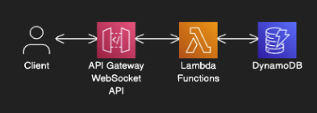

# WebSocket API Stack

A serverless WebSocket API implementation using AWS CDK, API Gateway WebSocket APIs, Lambda, and DynamoDB for real-time communication.

## Architecture

### Components

- **API Gateway WebSocket API**: Handles WebSocket connections
- **Lambda Functions**: Process WebSocket events
- **DynamoDB**: Stores connection information

## Features

- Real-time bidirectional communication
- Connection management
- Message broadcasting
- Secure VPC deployment
- Automatic scaling
- Connection cleanup

## Prerequisites

- AWS CDK CLI
- Node.js & npm
- Python 3.12
- AWS Account and configured credentials
- VPC with private subnets
