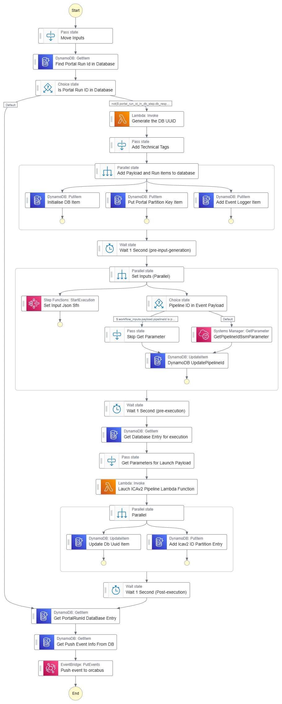
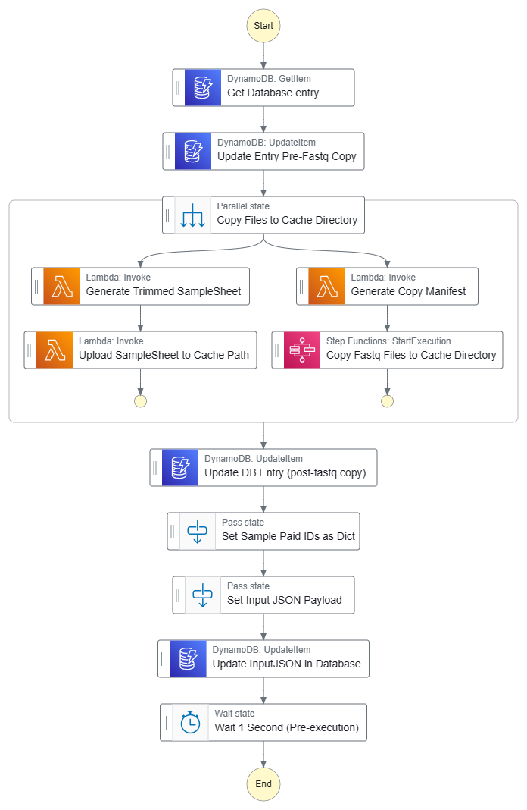
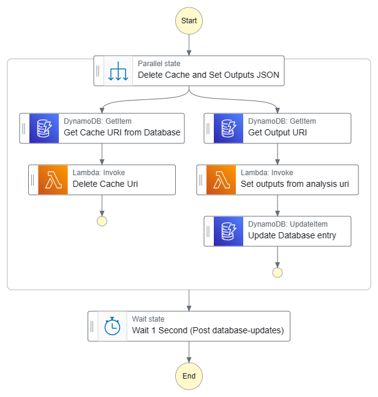

# ctTSO v2 pipeline manager

<!-- TOC -->
* [ctTSO v2 pipeline manager](#cttso-v2-pipeline-manager)
  * [StepFunctions Layout](#stepfunctions-layout)
    * [Workflow Run Manager Event Handler SFN](#workflow-run-manager-event-handler-sfn)
    * [ctTSO V2 Configure Inputs SFN](#cttso-v2-configure-inputs-sfn)
    * [Handle ICAv2 External Event SFN](#handle-icav2-external-event-sfn)
    * [ctTSO v2 Configure Outputs SFN](#cttso-v2-configure-outputs-sfn)
  * [Launch Inputs (via events)](#launch-inputs-via-events)
    * [Example Launch Event Payload](#example-launch-event-payload)
  * [Launching via the event](#launching-via-the-event)
  * [Monitoring inputs](#monitoring-inputs)
    * [Example external icav2 event](#example-external-icav2-event)
    * [Example internal published event](#example-internal-published-event)
    * [Termination event](#termination-event)
    * [Success event](#success-event)
    * [Fail event](#fail-event)
  * [Lambdas in this directory](#lambdas-in-this-directory)
    * [Generate a trimmed samplesheet](#generate-a-trimmed-samplesheet)
    * [Upload the samplesheet to the cache path](#upload-the-samplesheet-to-the-cache-path)
    * [Generate a copy manifest](#generate-a-copy-manifest)
    * [Set output json](#set-output-json)
    * [Delete the cache uri](#delete-the-cache-uri)
  * [SSM Parameters](#ssm-parameters-)
    * [External Parameters required by CDK](#external-parameters-required-by-cdk)
<!-- TOC -->

This Cttso V2 Pipeline Manager performs the following actions:

* Subscribes to the workflow run manager EventBus for a specific event (orcabus.wfm)
* Waits for a workflow run manager event to be published with the 'ready' status where the workflow type is set to `cttsov2`
* Launches the nextflow cttso v2 pipeline on ICAv2
  * This involves first fixing up the samplesheet
  * Moving fastq files and the samplesheet to a precise directory structure
  * Then launching the nextflow pipeline
* Tracks the status of the pipeline run through ICAv2 events.
* Logs launches, intermediate status changes and completions in a DynamoDB database table.  


## StepFunctions Layout

### Workflow Run Manager Event Handler SFN

> Handles events from the workflow run manager 

Triggered when status is set to `ready` and the workflow type is set to `cttsov2`

<details>

<summary>Click to view graph</summary>



</details>


### ctTSO V2 Configure Inputs SFN

> Required by the WFM SFN

This is a custom step function specific to this ctTSO v2 stack.  
Given the database UUID, generate the inputs-json for this workflow from parameters in the wfm payload.  

<details>

<summary>Click to view graph</summary>



</details>

An example input json might as below:

<details>

<summary>Click to expand!</summary>

```json
{
  "run_folder": "icav2://7595e8f2-32d3-4c76-a324-c6a85dae87b5/cttso_fastq_cache/v2_1_1/202405147fb93ec4/L2301368_run_cache/",
  "sample_sheet": "icav2://7595e8f2-32d3-4c76-a324-c6a85dae87b5/cttso_fastq_cache/v2_1_1/202405147fb93ec4/L2301368_run_cache/SampleSheet.csv",
  "sample_pair_ids": [
    "L2301368"
  ],
  "StartsFromFastq": true
}
```

</details>


### Handle ICAv2 External Event SFN

> Handles events from the ICAv2 event bus

Triggered when the ica-event code is set to ICA_EXEC_028 (workflow run state change).  
This will be triggered for analysis runs that do not relate to this workflow as well.  
The step function will first check the database to see if the analysis id is related to this workflow and exit if not.  

If the analysis id is related to this workflow, then publish an internal event with the status of the analysis is published.

If the analysis is in a terminal state, then the internal event will be published with the outputs of the analysis or the error code :construction:

<details>

<summary>Click to view graph</summary>


</details>

### ctTSO v2 Configure Outputs SFN

> Required by the ICAv2 External Event Handler SFN

This is a custom step function specific to this ctTSO v2 stack. 
This is only called if the icav2 external event handler sfn determines the analysis is in a successful terminal state (SUCCEEDED).  

This step function will take the db uuid, find the analysis output uri, and generate the outputs json for the analysis.

<details>

<summary>Click to view graph</summary>



</details>

An output json might be as shown below

<details>

<summary>Click to expand!</summary>

```json
{
  "resultsDir": "icav2://7595e8f2-32d3-4c76-a324-c6a85dae87b5/cttso_outputs/v2_1_1/202405147fb93ec4/out/Results/",
  "logsIntermediatesDir": "icav2://7595e8f2-32d3-4c76-a324-c6a85dae87b5/cttso_outputs/v2_1_1/202405147fb93ec4/out/Logs_Intermediates/",
  "tso500NextflowLogs": "icav2://7595e8f2-32d3-4c76-a324-c6a85dae87b5/cttso_outputs/v2_1_1/202405147fb93ec4/out/TSO500_Nextflow_Logs/",
  "samplePassed": true
}
```

</details>


## Launch Inputs (via events)

In the top level of the payload we require the following values

* detail-type - The type of event, this should be set to workflowRunStateChange
* source - The source of the event, this should be set to orcabus.wfm

The AWS Step functions takes in the following event information:

* status - The status of the workflow run manager event (should be 'ready')
* workflowType - this MUST be set to cttsov2
* workflowVersion - Not currently used, set to 1.0.0
* portalRunId - This is required to be set to a unique identifier for the run
* payload
  * refId: This is not tracked by this service, only by the workflow run manager service
  * version: The service version, not currently used, set to 2024.05.14
  * projectId: The icav2 project id
  * sampleId  (should match the sample_id in the samplesheet, ideally the lab metadata library id)
  * samplesheetB64gz  ((a base64 encoded and gzipped samplesheet as a dictionary, this can be found as an output of the bssh_icav2_fastq_copy_manager step functions)
  * fastqListRowsB64gz: (a base64 encoded and gzipped list of fastq rows as a dictionary, this can be found as an output of the bssh_icav2_fastq_copy_manager step functions)
    * This will use only the fastq files whose RGSM attribute match the sample id
  * analysisOutputUri: The icav2 uri that the analysis output should be stored at
  * cacheUri: the icav2 uri that the fastq files should be placed at (this directory should NOT exist as it will be deleted when the workflow completes)
  * icaLogsUri: The icav2 uri that the ica logs should be stored at (note that this currently doesn't work) - see https://github.com/umccr-illumina/ica_v2/issues/184 for more info
  * user_tags: (as a dict)
    * subject_id
    * library_id
    * instrument_run_id
    * project_owner
    * project_name

### Example Launch Event Payload

```json5
{
    "version": "0",
    "id": "2ce3c70c-e757-6246-5783-a83543d87ea7",
    "detail-type": "workflowRunStateChange",
    "source": "orcabus.wfm",
    "account": "843407916570",
    "time": "2024-05-10T08:25:12Z",
    "region": "ap-southeast-2",
    "resources": [],
    "detail": {
        "status": "ready",
        "workflowType": "cttsov2",
        "workflowVersion": "1.0.0",
        "portalRunId": "20240510abcd0030",
        "payload": {
            "refId": "abc",
            "version": "2024.05.14",
            "projectId": "7595e8f2-32d3-4c76-a324-c6a85dae87b5",
            "userReference": "cttsov2__semi_automated__umccr__pipeline",
            "sampleId": "L2301368",
            "samplesheetB64gz": "H4sIAAAAAAAAA6VT30vrMBh9318x8jwlaZ3zx1OoUC5cinjrg4iEbM1csElmkk1F9r/fL+26dlq9d8joIDnn+86Xk5P3wXCIFoIXwqKL4TusYD2XpWBzYxX3bC2sk0YDGI1q1K4001wJ2EK5e9ZHmZjeZDSKCSHxETnNzDqK0ZYstfN2pYT2zL8tqxrA+R/xjICwCSxkQd616mHJCJu9zUoRtsmYjDpI1IdIXYjXvSK8h3SL8E54OitnRsMJPXPCe6kfO2MoqaVaKeatVEoUrBIvhX70CyDF49E+jRd86YVlBtqVfBkoDYO7J+YWBlSak+6qnZn7F25Fx2Z0chwdT1DfkAX3HBj3VW09JhBKroOvWytCU66WcIGyCN1+RzEm8ekZ2sGVIwFKaZKnNM1p+gGMApoASvOE0qRFw+GsLETrJrqdZOSOnMSXvwiuvmajrWqsqS+26p2neQI/EKCgAzL5F/ToK3rF3sD/Q+WSd2aMcdlzj4eo/6f2B/JULPhamlV4QSjEBY0Oi9A3ATnI8V1mGjf6A/OPfGzh5rleZbTFPmXtB2GSE1Y/znqQ26trjPF5Bx/34u3FDzaDv92PM8i/BAAA",  /* pragma: allowlist secret */
            "fastqListRowsB64gz": "H4sIAAAAAAAAA9WP3U6EMBCF7/cpCNdCO1Pawt512YibdG+ANSbGNOVnDRFwZY1Gje9uucCfR/BiMpNzzkzmu1153ocrz/PzbLf1156fqbTMVFaqLEzdqMpUqTQE/2KJFfs5ppFRYCL+0fVm1g/jw/j4Ouqumuz0trjajq1zYQm3toHLrm8P+W5e6mr7gmtCJE94Gx8xYNiwIKqlCCzDKKiFjXlj21hWnHT9MJrT1A3uPkGKjCADAGEUBcrRUJBoNlfXes+3xY0kTAgQPJmjEWVU2qpuZJxQUtjh1LdnMj9ngCxE34MpwGhKweRgXAuP9vz8FN6/+78o8B9R4F8KB/G5ult9AfIjVBoDAgAA",  /* pragma: allowlist secret */
            "analysisOutputUri": "icav2://7595e8f2-32d3-4c76-a324-c6a85dae87b5/cttso_output/20240510abcd0030/out/",
            "icaLogsUri": "icav2://7595e8f2-32d3-4c76-a324-c6a85dae87b5/cttso_output/20240510abcd0030/logs/",
            "cacheUri": "icav2://7595e8f2-32d3-4c76-a324-c6a85dae87b5/cttso_fastq_cache/20240510abcd0030/out/",
            "userTags": {
              "subject_id": "SBJ04405",
              "library_id": "L2301368",
              "instrument_run_id": "231116_A01052_0172_BHVLM5DSX7",
              "project_owner": "UMCCR",
              "project_name": "Control"
            }
        }
    }
}
```


## Launching via the event

> A scripted example

<details>

<summary>Click to expand!</summary>

```shell
# Workflow input
sample_id="L2301368"  # PTC Sample
project_id="7595e8f2-32d3-4c76-a324-c6a85dae87b5"  # Trial project
samplesheet_b64gz="$( \
  jq --null-input --raw-output \
    '
      {
        "header": {
          "file_format_version": 2,
          "run_name": "Tsqn-NebRNA231113-16Nov23",
          "instrument_type": "NovaSeq"
        },
        "reads": {
          "read_1_cycles": 151,
          "read_2_cycles": 151,
          "index_1_cycles": 10,
          "index_2_cycles": 10
        },
        "bclconvert_settings": {
          "minimum_trimmed_read_length": 35,
          "minimum_adapter_overlap": 3,
          "mask_short_reads": 35,
          "software_version": "4.2.7"
        },
        "bclconvert_data": [
          {
            "lane": 1,
            "sample_id": "L2301368",
            "index": "GACTGAGTAG",
            "index2": "CACTATCAAC",
            "override_cycles": "U7N1Y143;I10;I10;U7N1Y143",
            "adapter_read_1": "CTGTCTCTTATACACATCT",
            "adapter_read_2": "CTGTCTCTTATACACATCT"
          }
        ],
        "tso500l_settings": {
          "adapter_read_1": "CTGTCTCTTATACACATCT",
          "adapter_read_2": "CTGTCTCTTATACACATCT",
          "adapter_behaviour": "trim",
          "minimum_trimmed_read_length": 35,
          "mask_short_reads": 35,
          "override_cycles": "U7N1Y143;I10;I10;U7N1Y143"
        },
        "tso500l_data": [
          {
            "sample_id": "L2301368",
            "sample_type": "DNA",
            "lane": 1,
            "index": "GACTGAGTAG",
            "index2": "CACTATCAAC",
            "i7_index_id": "UDP0009",
            "i5_index_id": "UDP0009"
          }
        ]
      }
    ' | \
  gzip | \
  base64
)"
fastq_list_rows_b64gz="$( \
  jq --null-input --raw-output \
    --arg project_id "${project_id}" \
    '
      [
        {
          "RGID": "GACTGAGTAG.CACTATCAAC.1",
          "RGSM": "L2301368",
          "RGLB": "UnknownLibrary",
          "Lane": 1,
          "Read1FileURI": "icav2://\($project_id)/ilmn_primary/2023/231116_A01052_0172_BHVLM5DSX7/3661659/20240307abcd7890/Samples/Lane_1/L2301368/L2301368_S1_L001_R1_001.fastq.gz",
          "Read2FileURI": "icav2://\($project_id)/ilmn_primary/2023/231116_A01052_0172_BHVLM5DSX7/3661659/20240307abcd7890/Samples/Lane_1/L2301368/L2301368_S1_L001_R2_001.fastq.gz"
        }
      ]
    ' | \
  gzip | \
  base64
)"

# Workflow output configurations
output_root_uri="icav2://${project_id}/cttso_outputs/v2_1_1/"
cache_root_uri="icav2://${project_id}/cttso_fastq_cache/v2_1_1/"

# Event metadata
portal_run_id="$(date +%Y%m%d)$(xxd -l 4 -c 4 -p < /dev/random)"
utc_time="$(date --utc --iso-8601=seconds | sed 's/+00:00/Z/')"

# Generate the input payload
input_payload="$( \
  jq --null-input --raw-output \
    --arg project_id "${project_id}" \
    --arg portal_run_id "${portal_run_id}" \
    --arg sample_id "${sample_id}" \
    --arg samplesheet_b64gz "${samplesheet_b64gz}" \
    --arg fastq_list_rows_b64gz "${fastq_list_rows_b64gz}" \
    --arg run_id "${run_id}" \
    --arg output_root_uri "${output_root_uri}" \
    --arg cache_root_uri "${cache_root_uri}" \
    '
      {
        "refId": null,
        "version": "2024.05.14",
        "projectId": $project_id,
        "userReference": "cttsov2__semi_automated__umccr__pipeline__\($portal_run_id)",
        "sampleId": $sample_id,
        "samplesheetB64gz": $samplesheet_b64gz,
        "fastqListRowsB64gz": $fastq_list_rows_b64gz,
        "instrumentRunId": $run_id,
        "analysisOutputUri": "\($output_root_uri)\($portal_run_id)/out/",
        "icaLogsUri": "\($output_root_uri)\($portal_run_id)/logs/",
        "cacheUri": "\($cache_root_uri)\($portal_run_id)/\($sample_id)_run_cache/",
        "userTags": {
          "subject_id": "SBJ04405",
          "library_id": "L2301368",
          "instrument_run_id": "231116_A01052_0172_BHVLM5DSX7",
          "project_owner": "UMCCR",
          "project_name": "Control"
        }
      }
    ' \
)"

# Generate the input detail
input_detail="$(
  jq --null-input --raw-output \
    --arg portal_run_id "${portal_run_id}" \
    --argjson input_payload "${input_payload}" \
    '
      {
        "status": "ready",
        "portalRunId": $portal_run_id,
        "workflowType": "cttsov2",
        "workflowVersion": "2.1.1",
        "payload": $input_payload
      }
    '
)"

# Generate the event entry
event_entry="$(
  jq --null-input --raw-output --compact-output  \
    --arg portal_run_id "$portal_run_id" \
    --arg utc_time "$utc_time" \
    --argjson input_detail "$input_detail" \
    '
      {
        "Entries": [
          {
            "EventBusName": "OrcaBusMain",
            "DetailType": "workflowRunStateChange",
            "Source": "orcabus.wfm",
            "Time": $utc_time,
            "Resources": [],
            "Detail": ( $input_detail | tojson )
          }
        ]
      }
    '
)"

# Push the event to the event bus
aws events put-events --cli-input-json "${event_entry}"
```

</details>

This will trigger the step function to launch the pipeline.  At the end of the launch, the step function will launch an event 
that looks like this

<details>

<summary>Click to expand</summary>

```json5
{
    "version": "0",
    "id": "0538dce6-3a6a-0898-14bc-ccd218e215f3",
    "detail-type": "workflowRunStateChange",
    "source": "orcabus.cttsov2",
    "account": "843407916570",
    "time": "2024-05-14T11:55:59Z",
    "region": "ap-southeast-2",
    "resources": [
        "arn:aws:states:ap-southeast-2:843407916570:stateMachine:cttsov2Sfn-wfm-ready-event-handler",
        "arn:aws:states:ap-southeast-2:843407916570:execution:cttsov2Sfn-wfm-ready-event-handler:edc51be2-9cf7-455d-603a-9bdd06bb9b52_d6efe59a-442e-1573-9069-dbece5b15b81"
    ],
    "detail": {
        "workflowType": "cttsov2",
        "workflowVersion": "2.1.1",
        "payload": {
            "refId": null,
            "version": "2024.05.07",
            "analysisOutput": "",
            "analysisId": "15347428-da1c-4adb-aae0-15cb0dcdbdff",
            "projectId": "7595e8f2-32d3-4c76-a324-c6a85dae87b5"
        },
        "portalRunId": "202405147fb93ec4",  /* pragma: allowlist secret */
        "timestamp": "2024-05-14T11:55:59.518Z",
        "status": "REQUESTED"
    }
}
```

</details>

## Monitoring inputs

This stack also creates an icav2 external event handler that will track any events that are published to the event bus.
This will trigger the tracking step function to launch, this will first look for the analysis id in the payload of the event in the
ctTSOv2 Database and determine if this analysis is part of this service.

If the analysis ID is not found in the database, no action is required, 
If the analysis ID is found in the database, this means it belongs to this service. 
We should then publish an internal event displaying the analysis' status for the portal run id


### Example external icav2 event

<details>

<summary>Click to expand!</summary>

```json5
{
  "analysis_id": "3e17b6ff-ff63-43ab-ac15-e939e88932b6",
  "analysis_launch_payload": {
    "userReference": "PTC-ctTSO-v2-launch-test",
    "pipelineId": "fdef5902-3f50-4ee7-ae17-15d38d4b489c",
    "tags": {
      "technicalTags": [
        "portal_run_id=20240308abcd1234",
        "step_functions_execution_arn=93f7c69b-66eb-4890-8eb4-298ec3b36d37"
      ],
      "userTags": [
        "subject_id=SBJ04405",
        "library_id=L2301368",
        "instrument_run_id=231116_A01052_0172_BHVLM5DSX7",  /* pragma: allowlist secret */
        "project_owner=UMCCR",
        "project_name=testing"
      ],
      "referenceTags": []
    },
    "analysisInput": {
      "inputs": [
        {
          "parameterCode": "run_folder",
          "dataIds": [
            "fol.58422302edd141213e0f08dc3cace45e"
          ]
        },
        {
          "parameterCode": "sample_sheet",
          "dataIds": [
            "fil.94813f45b9e94977b0a308dc388cf24f"
          ]
        }
      ],
      "parameters": [
        {
          "code": "StartsFromFastq",
          "value": "true"
        },
        {
          "code": "sample_pair_ids",
          "multiValue": [
            "L2301368"
          ]
        }
      ]
    },
    "activationCodeDetailId": "7f03a57e-2cfc-4b35-9cbb-d19e6ce9984b",
    "analysisStorageId": "3fab13dd-46e7-4b54-bb34-b80a01a99379",
    "outputParentFolderId": null,
    "analysisOutput": [
      {
        "sourcePath": "out/",
        "targetProjectId": "7595e8f2-32d3-4c76-a324-c6a85dae87b5",
        "targetPath": "/ilmn_cttso_fastq_cache/20240308abcd1234/",
        "type": "FOLDER"
      }
    ]
  }
}
```

</details>

### Example internal published event

<details>

<summary>Click to expand! </summary>

```json5
{
    "version": "0",
    "id": "614faa1f-154c-fdbc-fea0-a85f68513276",
    "detail-type": "workflowRunStateChange",
    "source": "orcabus.cttsov2",
    "account": "843407916570",
    "time": "2024-05-14T12:13:23Z",
    "region": "ap-southeast-2",
    "resources": [
        "arn:aws:states:ap-southeast-2:843407916570:stateMachine:cttsov2Sfn-icav2-external-handler",
        "arn:aws:states:ap-southeast-2:843407916570:execution:cttsov2Sfn-icav2-external-handler:99a2689f-56ce-3280-923c-5ef952310dd3_1b7fa736-7476-c156-42c9-e06ec45e52c3"
    ],
    "detail": {
        "workflowType": "cttsov2",
        "workflowVersion": "2.1.1",
        "payload": {
            "refId": null,
            "version": "2024.05.07",
            "analysisId": "15347428-da1c-4adb-aae0-15cb0dcdbdff",
            "projectId": "7595e8f2-32d3-4c76-a324-c6a85dae87b5",
            "analysisOutput": ""
        },
        "portalRunId": "202405147fb93ec4",  /* pragma: allowlist secret */
        "timestamp": "2024-05-14T12:13:23.194Z",
        "status": "IN_PROGRESS"
    }
}
```

</details>

### Termination event

If the analysis is in a terminal state, then the internal event will be published but the step function will
first collect either the outputs of the workflow or the error message.  


### Success event

In a success status event, the analysisOutput will be populated with the output uri of the analysis

<details>

<summary>Click to expand!</summary>

```json5
{
    "version": "0",
    "id": "d7c7533f-dca6-2e1e-9192-da1db055cc11",
    "detail-type": "workflowRunStateChange",
    "source": "orcabus.cttsov2",
    "account": "843407916570",
    "time": "2024-05-14T22:15:02Z",
    "region": "ap-southeast-2",
    "resources": [
        "arn:aws:states:ap-southeast-2:843407916570:stateMachine:cttsov2Sfn-icav2-external-handler",
        "arn:aws:states:ap-southeast-2:843407916570:execution:cttsov2Sfn-icav2-external-handler:7efe9afd-b9f4-4e4c-be85-8d4f92eb1b8d"
    ],
    "detail": {
        "workflowType": "cttsov2",
        "workflowVersion": "2.1.1",
        "payload": {
            "refId": null,
            "version": "2024.05.07",
            "analysisId": "15347428-da1c-4adb-aae0-15cb0dcdbdff",
            "projectId": "7595e8f2-32d3-4c76-a324-c6a85dae87b5",
            "analysisOutput": "{\"resultsDir\":\"icav2://7595e8f2-32d3-4c76-a324-c6a85dae87b5/cttso_outputs/v2_1_1/202405147fb93ec4/out/Results/\",\"logsIntermediatesDir\":\"icav2://7595e8f2-32d3-4c76-a324-c6a85dae87b5/cttso_outputs/v2_1_1/202405147fb93ec4/out/Logs_Intermediates/\",\"samplePassed\":true,\"tso500NextflowLogs\":\"icav2://7595e8f2-32d3-4c76-a324-c6a85dae87b5/cttso_outputs/v2_1_1/202405147fb93ec4/out/TSO500_Nextflow_Logs/\"}"
        },
        "portalRunId": "202405147fb93ec4",  /* pragma: allowlist secret */
        "timestamp": "2024-05-14T22:15:01.932Z",
        "status": "SUCCEEDED"
    }
}
```

</details>

### Fail event

:construction:

## Lambdas in this directory

### Generate a trimmed samplesheet

Generate a samplesheet that only has the TSO500L sections and only for the sample_id submitted in the inputs

### Upload the samplesheet to the cache path

Upload the samplesheet dict as a samplesheet csv to the cache path

### Generate a copy manifest

Generate a copy manifest for submissions to the icav2 copy batch utility

### Set output json

Set the output json for the cttso pipeline, given the output uri, find the results directory, tso500 nf logs and the 
logs intermediates directories.  

Look at the passing_samples_json file in the logs intermediates directory and for the given sample id, ensure that this
sample has passed all stages of the pipeline.  

### Delete the cache uri

Delete the fastq files and samplesheet csv, generated prior to launch. 
We don't need this directory once the pipeline has completed.  

## SSM Parameters 

### External Parameters required by CDK

```
/icav2/umccr-prod/tso500_ctdna_2.1_pipeline_id
```
