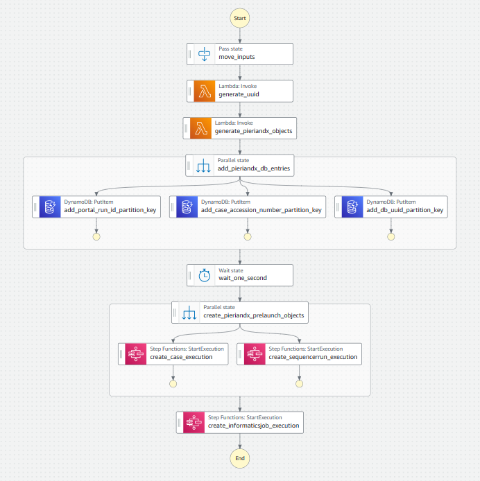
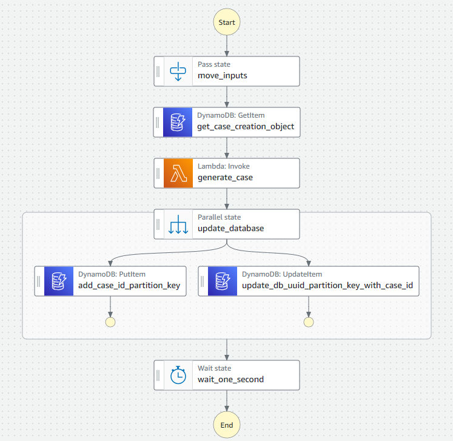
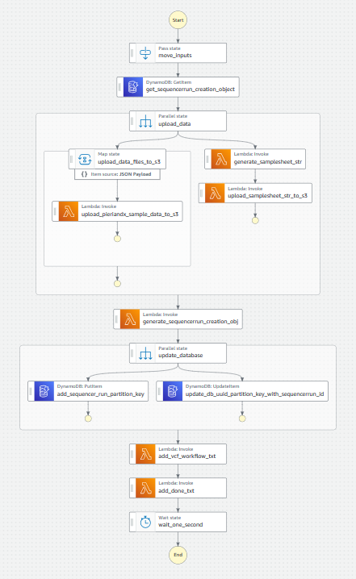
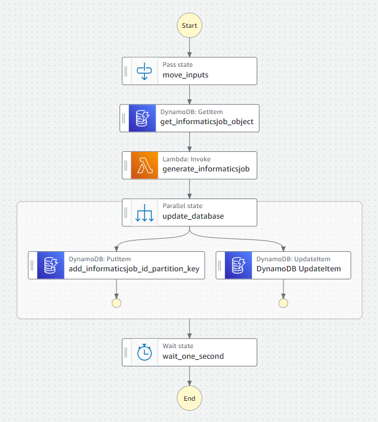

# PierianDx Pipeline Manager

Giant, serverless pipeline attached to a serverless database

## Using the AWS Launch Step function

The AWS Launch step function takes in the following inputs

* dag: Object
  * name: string  # The name of this case dag
  * description: string  # The description of this case dag
* case_metadata: Object
  * panel_name: string  # The name of this case’s panel _tso500_DRAGEN_ctDNA_v2_1_Universityofmelbourne_  # pragma: allowlist secret
  * specimen_label: string  # The label of the specimen  _primarySpecimen_
  * sample_type: Enum  # patientcare, clinical_trial, validation, proficiency_testing
  * indication: String  # Optional input
  * disease: Object
    * code: string  # The disease id
    * label: string  # The name of the disease (optional)
  * is_identified: bool  # Boolean  is this a boolean identified case or de-identified case
  * case_accession_number: string - must be unique - uses syntax SBJID__LIBID__NNN
  * specimen_type:
    * code: string   # The SNOMED-CT term for a specimen type
    * label: Optional label for the specimen type
  * external_specimen_id: string  # The external specimen id  
  * date_accessioned: Datetime  # The date the case was accessioned  _2021-01-01T00:00:00Z_
  * date_collected:  Datetime  # The date the specimen was collected  _2021-01-01T00:00:00Z_
  * date_received:  Datetime  # The date the specimen was received  _2021-01-01T00:00:00Z_
  * gender:  Enum  # unknown, male, femail, unspecified, other, ambiguous, not_applicable  # Optional
  * ethnicity:  Enum  # unknown, hispanic_or_latino, not_hispanic_or_latino, not_reported  # Optional
  * race:  Enum  # american_indian_or_alaska_native, asian, black_or_african_american, native_hawaiian_or_other_pacific_islander, not_reported, unknown, white  # Optional
   
  > Note: If the case is de-identified, the following fields are required
  * study_id:  String  # Only required if is_identified is false
  * participant_id:  String  # Only required if is_identified is false
  
  > Note: If the case is identified, the following fields are required
  * date_of_birth:  Datetime  # Only required if is_identified is true
  * first_name:  String  # Only required if is_identified is true
  * last_name:  String  # Only required if is_identified is true
  * medical_record_numbers:  Object  # Only required if is_identified is true
    * mrn: string  # The medical record number
    * medical_facility: Object
      * facility: string  # The name of the facility 
      * hospital_number: string  # The hospital number
  * requesting_physicians:  Object  # The requesting physician - required for identified cases
    * first_name: string
    * last_name: string

* data_files:  Object
  * microsat_output:  uri
  * tmb_metrics:  uri
  * cnv:  uri
  * hard_filtered:  uri
  * fusions:  uri
  * metrics_output:  uri

* samplesheet_b64gz:  str
* portal_run_id:  str
* sequencerrun_s3_path_root:  str

## DataBase Structure

> IDs
* db_uuid
* portal_run_id
* case_id
* sequencerun_id
* informaticsjob_id
* report_id
* case_accession_number

> Objects
* samplesheet_b64gz:  str
* case_creation_obj:  CaseCreationObject
* sequencerrun_creation_obj:  SequencerRunCreationObject
* informaticsjob_creation_obj:  InformaticsJobCreationObject
* data_files: List[DataFileObject]

> Status
* job_status:  waiting, ready, running, complete, failed, canceled
* report_status:  waiting, ready, running, complete, failed, canceled, report_generation_complete

## Step Function execution structure

### Launch Overview

This will trigger three sub-step-functions, case creation, sequencerrun creation and informatics job creation



The whole process should not take more than 30 seconds

### Case Creation Overview

Generate the case object, this defines the case metadata and will generate a case id (required for the informatics job section)



### Sequencer Run Overview

Upload the data files from ICAv2 to the PierianDx S3 bucket.

Generate a samplesheet and upload it to the PierianDx S3 bucket.

Create a sequencer run object, this defines the sequencer run metadata and will generate a sequencer run id (required for the informatics job section)



### Informatics Job Overview

Generate an informatics job for the case. 

This will return an informatics job id. 




## Launch Execution Example


```
aws events put-events --no-cli-pager --cli-input-json "$( \
  jq --raw-output --compact-output \
    '
      {
        "Entries": [
          {
            "EventBusName": "OrcaBusMain",
            "DetailType": "workflowRunStateChange",
            "Source": "orcabus.manual",
            "Time": $utc_time,
            "Resources": [],
            "Detail": {
              "portalRunId": "abcd1234",
              "timestamp": "20240920T113200Z",
              "status": "READY",
              "workflowName": "pieriandx",
              "workflowVersion": "2.1.1",
              "workflowRunName": "umccr-automated--pieriandx--2-1-1--abcd1234",
              "linkedLibraries": [
                {
                  "libraryId": "L2400161",
                  "orcabusId": "NA"
                }
              ],
              "payload": {
                "version": "2024.10.01",
                "data": {
                  "inputs": {
                    "instrumentRunId": "231116_A01052_0172_BHVLM5DSX7",
                    "dagVersion": "2.1.1",
                    "panelVersion": "main",
                    "caseMetadata": {
                      "isIdentified": true,
                      "caseAccessionNumber": "SBJ04407__L2400161__V2__abcd1238",
                      "externalSpecimenId": "externalspecimenid",
                      "sampleType": "PatientCare",
                      "specimenLabel": "primarySpecimen",
                      "indication": "Test",
                      "diseaseCode": 64572001,
                      "specimenCode": 122561005,
                      "sampleReception": {
                        "dateAccessioned": "2021-01-01T00:00:00Z",
                        "dateCollected": "2024-02-20T20:17:00Z",
                        "dateReceived": "2021-01-01T00:00:00Z"
                      },
                      "patientInformation": {
                        "dateOfBirth": "1970-01-01",
                        "firstName": "John",
                        "lastName": "Doe"
                      },
                      "medicalRecordNumbers": {
                        "mrn": "3069999",
                        "medicalFacility": {
                          "facility": "Not Available",
                          "hospitalNumber": "99"
                        }
                      },
                      "requestingPhysician": {
                        "firstName": "Meredith",
                        "lastName": "Gray"
                      }
                    },
                    "dataFiles": {
                      "microsatOutputUri": "s3://pipeline-dev-cache-503977275616-ap-southeast-2/byob-icav2/development/analysis/cttsov2/20240910d260200d/Logs_Intermediates/DragenCaller/L2400161/L2400161.microsat_output.json",
                      "tmbMetricsUri": "s3://pipeline-dev-cache-503977275616-ap-southeast-2/byob-icav2/development/analysis/cttsov2/20240910d260200d/Logs_Intermediates/Tmb/L2400161/L2400161.tmb.metrics.csv",
                      "cnvVcfUri": "s3://pipeline-dev-cache-503977275616-ap-southeast-2/byob-icav2/development/analysis/cttsov2/20240910d260200d/Results/L2400161/L2400161.cnv.vcf.gz",
                      "hardFilteredVcfUri": "s3://pipeline-dev-cache-503977275616-ap-southeast-2/byob-icav2/development/analysis/cttsov2/20240910d260200d/Results/L2400161/L2400161.hard-filtered.vcf.gz",
                      "fusionsUri": "s3://pipeline-dev-cache-503977275616-ap-southeast-2/byob-icav2/development/analysis/cttsov2/20240910d260200d/Results/L2400161/L2400161_Fusions.csv",
                      "metricsOutputUri": "s3://pipeline-dev-cache-503977275616-ap-southeast-2/byob-icav2/development/analysis/cttsov2/20240910d260200d/Results/L2400161/L2400161_MetricsOutput.tsv",
                      "samplesheetUri": "s3://pipeline-dev-cache-503977275616-ap-southeast-2/byob-icav2/development/analysis/cttsov2/20240910d260200d/Logs_Intermediates/SampleSheetValidation/SampleSheet_Intermediate.csv"
                    }
                  },
                  "engineParameters": {},
                  "tags": {
                    "libraryId": "L2400161",
                    "subjectId": "SBJ04407",
                    "instrumentRunId": "231116_A01052_0172_BHVLM5DSX7",
                    "isIdentified": true,
                    "metadataFromRedCap": true
                  }
                }
              }
            }
          }
        ]
      }
    '
)"
```

DAGs (PROD)

```json
{
  "name": "cromwell_tso500_ctdna_workflow_1.0.4",
  "description": "tso500_ctdna_workflow"
}
```

Panels (PROD)

```json5
[
  {
    "name": "tso500_DRAGEN_ctDNA_v2_1_Universityofmelbourne",  // pragma: allowlist secret
    "label": "TSO500 DRAGEN ctDNA v2.1"
  },
  {
    "name": "tso500_ctDNA_vcf_subpanel_workflow_university_of_melbourne",
    "label": "TruSight Oncology 500 ctDNA (VCF) Sub-panel"
  },
  {
    "name": "Melbourne_WGS_Somatic_Textual",
    "label": "Melbourne WGS Somatic"
  },
  {
    "name": "tso500_ctDNA_vcf_workflow_university_of_melbourne",
    "label": "TruSight Oncology 500 ctDNA (VCF) University of Melbourne"
  },
  {
    "name": "Melbourne_WGS_Somatic_Textual_SAS",
    "label": "Melbourne WGS Somatic New"
  }
]
```