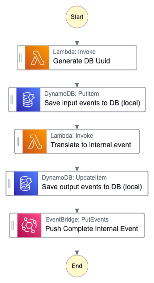
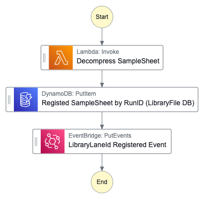
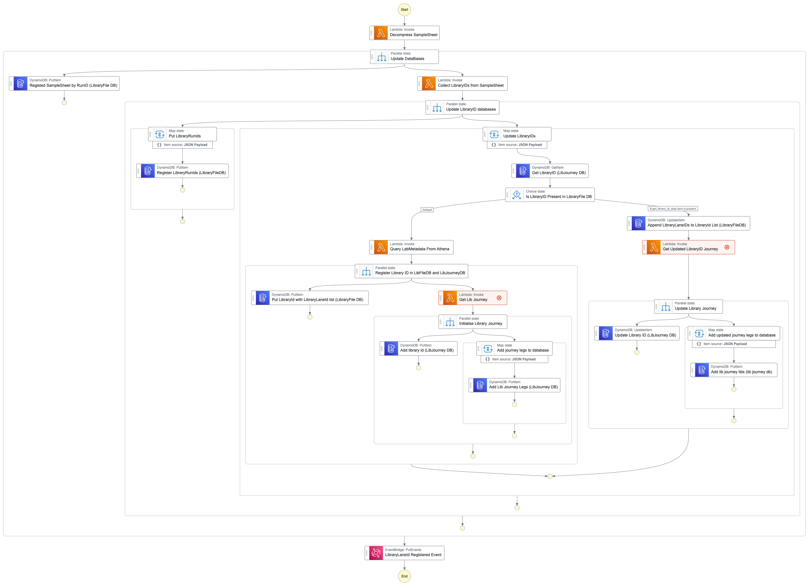
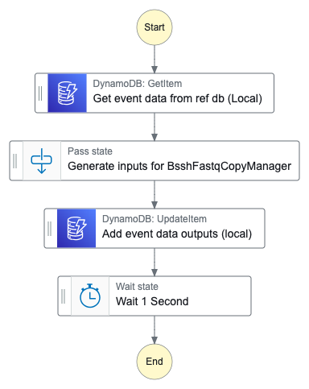
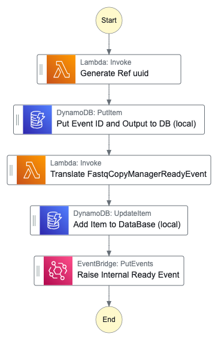

# Scotch Glue

> A stock-standard glue.

## Four parts to this construct:

### Part 1

* Input Event Source: `orcabus.bclconvertmanager`
* Input Event DetailType: `orcabus.workflowrunstatechange`
* Input Event status: `complete`

* Output Event source: `orcabus.workflowmanager`
* Output Event DetailType: `orcabus.workflowrunstatechange`
* Output Event status: `complete`

* The BCLConvertManagerEventHandler Construct
  * This will be triggered by the completion event from the BCLConvertManager stack.
  * Contains a standard workflow run statechange, and includes the samplesheet gz and the instrument run id
  * Pushes a workflow run manager event saying that the BCLConvert Manager has complete.

### Part 2

* Input Event Source: `orcabus.workflowmanager`
* Input Event DetailType: `orcabus.workflowrunstatechange`
* Input Event status: `complete`

* Output Event source: `orcabus.instrumentmanager`
* Output Event DetailType: `orcabus.samplesheetstatechange`
* Output Event status: `samplesheetregistered`

* The UpdateDataBaseOnNewSampleSheet Construct
  * Subscribes to the BCLConvertManagerEventHandler Stack outputs and updates the database:
    * Registers all library run ids in the samplesheet
    * Appends libraryrunids to the library ids in the samplesheet
    * For a given library id, queries the current athena database to collect metadata for the library
      * assay
      * type
      * workflow etc.

OR

### Part 3

* Input Event Source: `orcabus.workflowmanager`
* Input Event DetailType: `orcabus.workflowrunstatechange`
* Input Event status: `complete`

* Output Event source: `orcabus.bsshfastqcopyinputeventglue`
* Output Event DetailType: `orcabus.workflowrunstatechange`
* Output Event status: `complete`

* The BsshFastqCopyManagerInputMaker Construct
  * Subscribes to the BCLConvertManagerEventHandler Stack outputs and creates the input for the BSSHFastqCopyManager
  * Pushes an event payload of the input for the BsshFastqCopyManagerReadyEventSubmitter

  

With the parent function displayed here:

### Part 4

* Input Event Source: `orcabus.bsshfastqcopymanagerinputeventglue`
* Input Event DetailType: `orcabus.workflowrunstatechange`
* Input Event status: `complete`

* Output Event source: `orcabus.workflowmanager`
* Output Event DetailType: `orcabus.workflowrunstatechange`
* Output Event status: `ready`

* The BsshFastqCopyManagerReadyEventSubmitter Construct
  * Subscribes to the BCLConvertManagerEventHandler Stack outputs and generates a ready event for the BSSHFastqCopyManager

