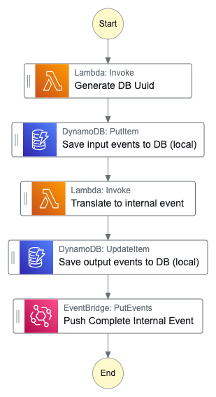
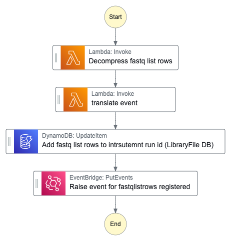
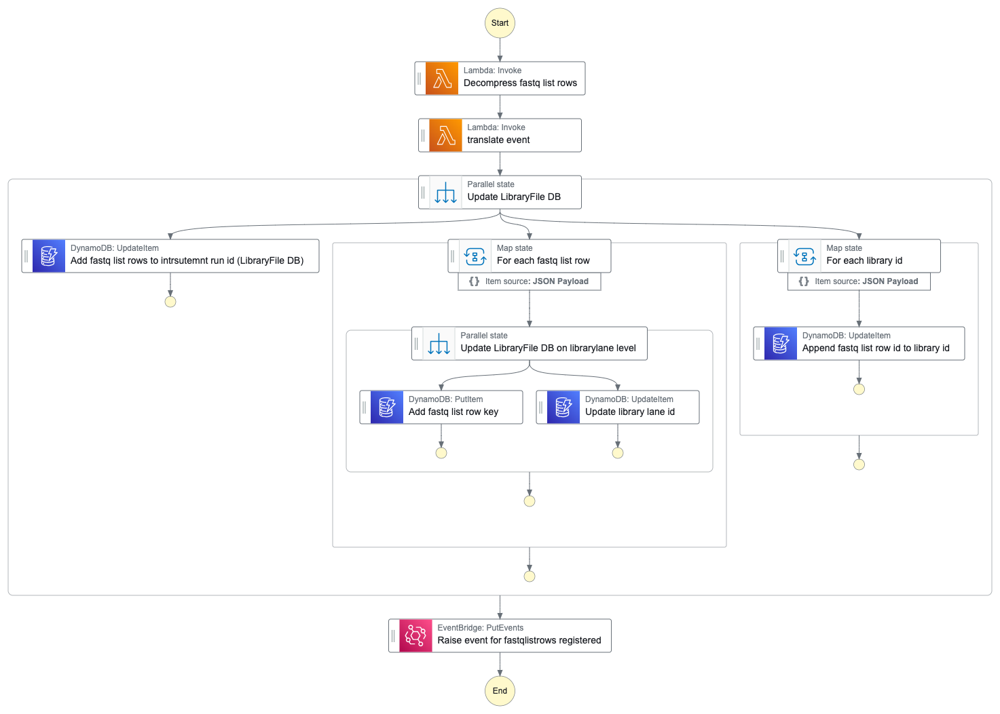
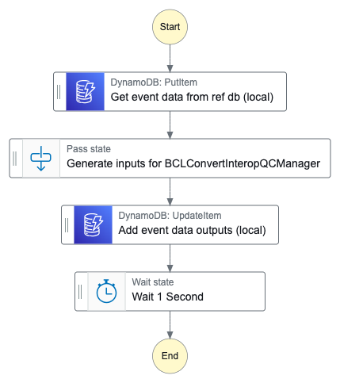

# Selleys Glue

> Glue for the common orcabus

## Four parts to this construct:

### Part 1

Input Event Source: `orcabus.bsshfastqcopymanager`
Input Event DetailType: `WorkflowRunStateChange`
Input Event status: `succeeded`

Output Event source: `orcabus.workflowmanager`
Output Event DetailType: `WorkflowRunStateChange`
Output Event status: `complete`

* The BSSHFastqCopyManagerEventHandler Construct
  * This will be triggered by the completion event from the BSSHFastqCopyManager Construct.
  * Contains a standard workflow run statechange, the fastqlistrowgzipped, and instrument run id
  * Pushes a workflow run manager event saying that the BSSHFastqCopyManager has complete.



### Part 2

Input Event Source: `orcabus.workflowmanager`
Input Event DetailType: `WorkflowRunStateChange`
Input Event status: `complete`

Output Event source: `orcabus.instrumentrunmanager`
Output Event DetailType: `orcabus.librarystatechange`
Output Event status: `fastqlistrowsregistered`

* The UpdateDataBaseOnNewFastqListRows Construct
  * Subscribes to the BSSHFastqCopyManagerEventHandler Construct outputs and updates the database:
    * Registers all fastq list rows in the database and tie them to the libraryrunid
    * Appends libraryrunids to the library ids in the samplesheet
    * Pushes an event to say that some fastq list rows have been added to the database, with a list of affected library ids and the instrument run id



OR



### Part 3

Input Event Source: `orcabus.workflowmanager`
Input Event DetailType: `WorkflowRunStateChange`
Input Event status: `complete`

Output Event source: `orcabus.bclconvertinteropqcinputeventglue`
Output Event DetailType: `WorkflowRunStateChange`
Output Event status: `complete`

* The BCLConvertInteropQCInputMaker Construct
  * Subscribes to the BSSHFastqCopyManagerEventHandler Construct outputs and creates the input for the BCLConvertInteropQC
  * Pushes an event payload of the input for the BCLConvertInteropQCReadyEventSubmitter



With the parent function displayed here:


### Part 4

Input Event Source: `orcabus.bclconvertinteropqcinputeventglue`
Input Event DetailType: `WorkflowRunStateChange`
Input Event status: `complete`

Output Event source: `orcabus.workflowmanager`
Output Event DetailType: `WorkflowRunStateChange`
Output Event status: `ready`

* The BCLConvertInteropQCReadyEventSubmitter Construct
  * Subscribes to the BSSHFastqCopyManagerEventHandler Construct outputs and generates a ready event for the BCLConvertInteropQC


## Triggering this construct

The scotch pipeline is triggerd by a WorkflowRunStateChange success event by the bssh fastq copy Manager.  

We can emulate this event with the following code

<details>

<summary>Click to expand!</summary>

```shell
data_json="$(
  jq --null-input --raw-output \
    '
      {
        "instrumentRunId": "240229_A00130_0288_BH5HM2DSXC",
        "fastqListRowsB64gz": "H4sIAF2wVmYC/9Wb7WvcRhDG/xVzn2OdtC96ybfNhmwKzpdoC4FShGpfwoEdUqcU2tL/vTO6y8aNnltz92kWbN8gGfthfszsPKvVL/9s3oefXm9eXm2CczH6EKsYXQyOgmbz4opuj+/49o0ydd3U6nDt5tWP127mzzu61vDt3XzXvNnf735+3POv7W/nP9XL7bazg931H9W1Vnf62tx27fWslbm+befe3s27vvvNbvf3D5+nL4/7h/nxry39faWGydF/0fVUq76fXr21b9+p1+MHv1U13beqv5vb2tRNsx3nhy/3u69b1jI122/yUjCNzXRD0fS+meij+jh//eP36tPfm6NoJVu0+r/of19cPaXH/EKIzC94+vLBIYJ2WBM8XBNL0A4pmEZVCEEoOkeQAIbgnfO+8t5F+oouIIJtvSZ4uCaWYFunYBp1IQSh6BzBJ9iewEQEG0CwkU3wezCNphSCSHS+i0bmxq0zMM1AfRTXIFgHW9nrYKtSMI22FIJIdLaLLmtgcD5SDdLHghMS1ICglk1Qp2Aa21IIItE5gjR9ctX5yOtgpBbKECFBAwga2QRNCqaxK4UgEp0lGIkbdU/n2UsQvZOTTAsItrIJtimYxr4Ugkj0M1300Dg9m0KqwUqt6Q12Te9w7UhPiaH3bRUZbAqmceBEKLn0sqKz9Lht0ihD/ZMaKVtCRA/U3tDKptemgExxXQo+qDo7hUai5sLSPePiIRC/DvDrZPPrUkCZaErhB1Vn1z8faMGLgX08fXpUf0qvPeDxmlR+JC8FlAlVBr8TqrP1x8VH3MgDOq5ED/n1gF8vm1+fAsqELoUfVP2cB2TzXtHaR90z4vobAL9BNr8hBZQJUwo/qDpbfzx10o+K1j6aXuD6R99rfqYWzc/UKaBM2EL4YdXnuQd9gXvQYvjpk4O4losvK/o896AvcA8C6a3n8BLwQdXnuQd9gXsQyG89h5fAD6o+zz3oC9yDOH5oDpfP74Tq89yDvsA9COS3nsNL4AdVn+ce9AXuQSC/9RxeAj+o+jz3oC9wD/L4gTm8AH5YdX7+DFx1PHgeAdIgUxnw9Ag4iPapgzBiGKYnaDYFlI3laaiRyzCv+pkaPCx9/CTXcQD4DeAUzNCI5jc0KaBMdIXww6rP8xDmAg8hkN96Gi+BH1SdPYkW+RgMeXguQo4hvx7w62Xz61NAmehL4QdV5+svsvuL7CGWc9mAnzLAAxrR/ZPkpYAyMZTB74Tq/AyzVJ2v0lYo4qcAPyWbX9oUVtOo6lL4QdX5s9iR34Vwywk0z5uhiB/wgGaQzW9IAWWiKYUfVJ0/x8sV6Kl/Rr8cJkT8LPCAthbNz9YpoEyoQvhh1Xn/4P1xD3Sx87D+LFj/rOz1zzYpoEzoUvhB1dk97OXktednSMtudoD8wPpnZa9/VqWAMmFK4QdVZ/0Dv8hC7Gh+4TcivIP8NOCnZfPTKaBM2FL4QdV5/8f2PbqKjcTyDBfxM4Cfkc3ve0CZaEvhB1U/8x4SNU5qm46LjwBCfhbws7L52RRQJrpS+EHVWf/Ab614nl+WR0kn1r8W8Gtl82tTQJnoS+EHVef3X8Ly7KGKyyCK/Z/tAL9ONr8uBZSJUvZfsOof+f36H1n1Xz7MQAAA"
      }
    ' \
)"

payload_json="$(
  jq --null-input --raw-output \
    --argjson data_json "${data_json}" \
    '
      {
        "refId": null,
        "version": "2024.05.15",
        "data": $data_json
      }
    ' \
)"
  
detail_json="$(
  jq --null-input --raw-output \
    --argjson payload_json "${payload_json}" \
    '
      {
        "status": "succeeded",
        "workflowName": "bsshFastqCopy",
        "workflowVersion": "1.0.0",
        "portalRunId": "20240528da604011",
        "payload":  $payload_json
      }
    ' \
)"

event_entry="$(
  jq --null-input --raw-output --compact-output \
    --arg utc_time "$(date --utc --iso-8601=seconds | sed 's/+00:00/Z/')" \
    --argjson input_detail "${detail_json}" \
    '
      {
        "Entries": [
          {
            "EventBusName": "OrcaBusMain",
            "DetailType": "WorkflowRunStateChange",
            "Source": "orcabus.bsshfastqcopymanager",
            "Time": $utc_time,
            "Resources": [],
            "Detail": ( $input_detail | tojson )
          }
        ]
      }
    ' \
)"
  
aws events put-events --cli-input-json "${event_entry}"
```

</details>
