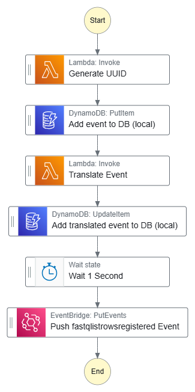
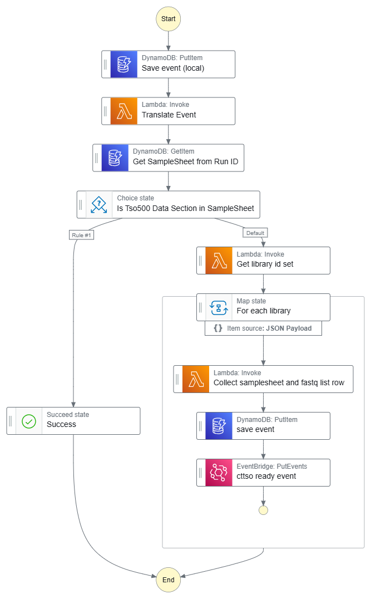
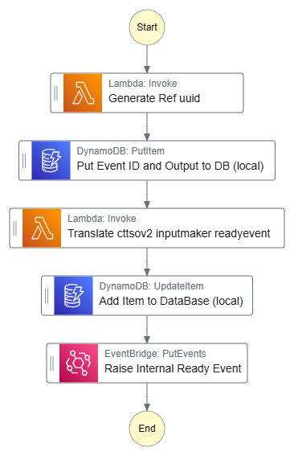

# Super Glue

> Glue for the common orcabus

## Part C - Glue the FastqListRow Output Event to the ctTSOv2ReadySfn

> This will be all one stack

The most important glue of them all. Super Glue!

### Construct C (Part 1)

Input Event Source: `orcabus.metadatamanager`
Input Event DetailType: `orcabus.librarystatechange`
Input Event status: `fastqlistrowregistered`

Output Event source: `orcabus.workflowrunmanager`
Output Event DetailType: `orcabus.librarystatechange`
Output Event status: `fastqlistrowsregistered`

* The FastqListRowEventHandler Construct
  * This will be triggered by the completion event from the UpdateDataBaseOnNewFastqListRows complete event.
  * Contains a standard workflow run statechange
  * And a list of fastq list rows / library ids that have changed, and the instrument run id

### Construct C (Part 2)

Input Event source: `orcabus.workflowrunmanager`
Input Event DetailType: `orcabus.librarystatechange`
Input Event status: `fastqlistrowsregistered`

Output Event source: `orcabus.cttsov2inputeventglude`
Output Event DetailType: `orcabus.workflowrunstatechange`
Output Event status: `complete`

* The ctTSOv2InputMaker Construct
  * Subscribes to the FastqListRowEventHandler Construct outputs and creates the input for the ctTSOv2ReadySfn
  * Pushes an event payload of the input for the ctTSOv2ReadyEventSubmitter

### Construct C (Part 3)

Output Event source: `orcabus.cttsov2inputeventglude`
Output Event DetailType: `orcabus.workflowrunstatechange`
Output Event status: `complete`

Output Event source: `orcabus.workflowrunmanager`
Output Event DetailType: `orcabus.workflowrunstatechange`
Output Event status: `ready`

* The ctTSOv2ReadyEventSubmitter Construct
  * Subscribes to the ctTSOv2InputMaker Construct outputs and generates a ready event for the ctTSOv2ReadySfn

