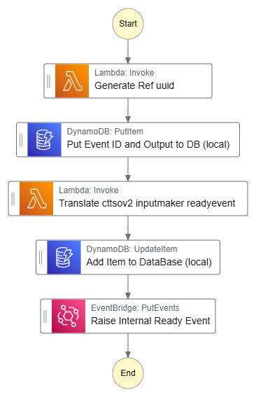

# Super Glue

> Glue for the common orcabus

## Part C - Glue the FastqListRow Output Event to the ctTSOv2ReadySfn

> This will be all one stack

The most important glue of them all. Super Glue!

### Construct C (Part 1)

Input Event Source: `orcabus.instrumentrunmanager`
Input Event DetailType: `orcabus.librarystatechange`
Input Event status: `fastqlistrowregistered`

Output Event source: `orcabus.cttsov2inputeventglue`
Output Event DetailType: `orcabus.workflowrunstatechange`
Output Event status: `awaitinginput`

* The fastqListRowsToctTSOv2InputMaker Construct
  * Subscribes to the FastqListRowEventHandler Construct outputs and creates the input for the ctTSOv2ReadySfn
  * Pushes an event payload of the input for the ctTSOv2ReadyEventSubmitters
  * From the awaiting input event, we then generate a workflow ready status for each of the cttso run workflows

### Construct C (Part 2)

Output Event source: `orcabus.cttsov2inputeventglue`
Output Event DetailType: `orcabus.workflowrunstatechange`
Output Event status: `awaitinginput`

Output Event source: `orcabus.cttsov2inputeventglue`
Output Event DetailType: `orcabus.workflowrunstatechange`
Output Event status: `ready`

* The ctTSOv2InputMaker, subscribes to the cttsov2 input event glue (itself) and generates a ready event for the ctTSOv2ReadySfn
  * For the cttso v2 workflow we require a samplesheet, a set of fastq list rows (provided in the last step)
  * However, in order to be 'ready' we need to use a few more variables such as  
    * icaLogsUri,
    * analysisOuptutUri
    * cacheUri
    * projectId
    * userReference

### Construct C (Part 3)

Output Event source: `orcabus.cttsov2inputeventglue`
Output Event DetailType: `orcabus.workflowrunstatechange`
Output Event status: `ready`

Output Event source: `orcabus.workflowmanager`
Output Event DetailType: `orcabus.workflowrunstatechange`
Output Event status: `ready`

* The ctTSOv2ReadyEventSubmitter Construct
  * Subscribes to the ctTSOv2InputMaker Construct outputs and generates a ready event for the ctTSOv2ReadySfn

